# Sizing of the transducers based on existing transducers

## Introduction
The resolution of a mechanical ultrasound probe is given by the geometry of the transducer, contrary to an electronical probe where the resolution is given by the beamformer. The choice of the transducer in such ultrasound system is then primordial to access a good image quality. In order to define the spefication of the transducers for the echOpen prototype, we can inspire by what is already done by the ultrasound scanners.

In a previous study, we have identify two ultrasound scanners that are interesting to us: the Ultramark 4 plus with ATL probe and the Toshiba Nemio. The ATL probes are mechanical probes, such as what we want to do, that give an image quality close, but a little bit lesser, than what we expected. In fact the « raw quality » is enough (in term of resolution and differenciation) but the image rendering is not enough (maybe just because it’s an old device). The Toshiba Nemio is a more modern device with electronic probes that have a very good image quality, far better than what we need. The goal of this document is to determine the resolution of the transducers we need based on the resolution of these two devices. A first sizing of a transducer can be done by determining the size of the transducers used in the ATL probe and interpolated it to the frequencies of interest. The theoretical resolution of this transducer will be compared to the one of the two devices. To determine the resolution of the existing ultrasound scanner we had designed a new phantom wich allow us to access the aproximate resolution of the probe.

In this document we will first retreive the size of the transducers used in the ATL probe, and determine it’s theoretical resolution. Secondly we prensent the phantom we have develop to determine the resolution of an ultrasound scanner. Then we compare the resolution of two existing ultrasound scanner with the resolution of the retro-ingeniered transducer. Based on these informations, we interpolated the size of each transducer we need.

## ATL transducer
During our tests, we have shown that the images made by the ATL access C 3M (with an Ultramark 4 plus) have a good resolution (Pierre Bourrier has validated the sagittal liver/right kidney view given by this device). Here one can see this probe:

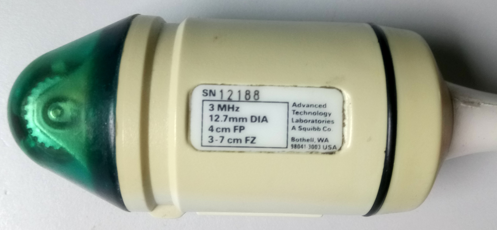

it is a mechanical probe composed of three rotating transducers. As we can see on the probe, their is some informations about the transducers used inside (the three transducers are identicals):

* central frequency: 3 MHz,
* diameter: 12.7 mm,
* focal point (FP) at 40 mm (the question here does FP stand for the acoustic focal point or for the geometrical focal point given by the curvature radius),
* focal zone (FZ) from 30 to 70 mm.

Some researchers from the GREMAN laboratory provide us a spreadsheet that calculate some properties of the focal zone of a transducer following it’s geometry at a given frequency. Following this spreadsheet, if we consider FP as the curvature radius, then the focal zone does not correspond to the one given on the probe. But if we change the curvature radius CR until the acoustical focal point reach 40 mm (CR = 60 mm), then we find approximatively the same focal zone, so FP stand for the acoustical focal point. Using we find the amplitude of the acoustic fiel along the axis of the transducer versus depth:

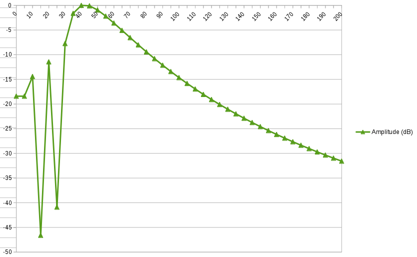

We see that the focal zone begin at 30 mm depth and at the maximum depth of measurement (200 mm) the relative amplitude is around -27 dB.
The full width at half maximum (FWHM) versus depth of this transducer is as following:

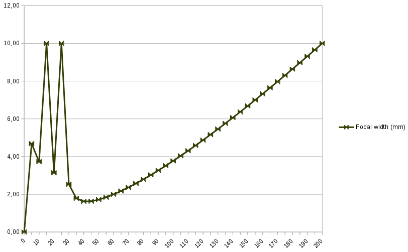

At the focal point, the FWHM is 1.6 mm and goes to 10 mm at maximum depth. So the minimum resolution (at the focal point) of this probe is 1.6 mm. Following the datasheet of the Ultramark 4 plus, page 72, the lateral resolution of this transducer is 3.5 mm (strangely nearly two times the resolution we find).

## Resolution phantom

The first question we had was how we can detemine the resolution of a ultrasound scanner. The resolution of a device is the minimum distance between two object from wich we can separate them. So if the distance between two objects is under this distance we see only one point on the screen:

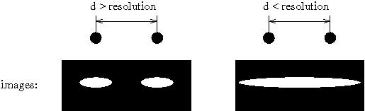

here the resolution of the image is not the same along x and y as for an ultrasound scanner. So we see it is relatively easy to determine the resolution of a device, we have to put point scatterers with a given distance between them and see since when we see two differents points on the image.

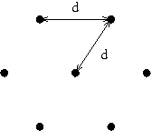

To make the point scatterer we use nylon wire with a diameter of 0.15 mm. We have different parallel to each other put orthogonally to the image plan. These wires are spread on a triangular shape using an hexagonal lattive so the distance between each wire is the same, we have different triangular shape where we increase the distance between the wire:

where d varies from 1.0 to 4.0 mm with a step of 0.5 mm. Finally, the phantom looks like that:

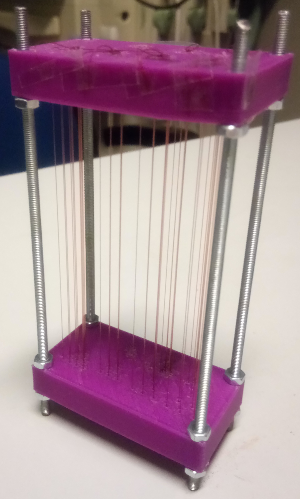

where the first top left triangle was not made because when printing the piece with a 3D printer the holes where fill by the plastic wire during printing. We can see on the following picture an image made by the Ultramark 4 plus with this phantom:

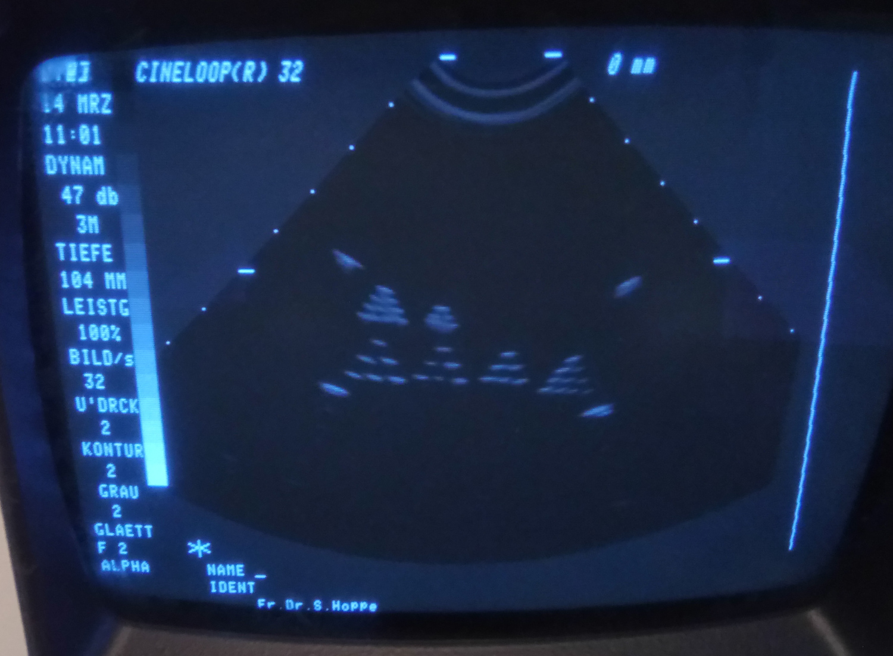

here we can see that we have the resolution is between 2.0 and 2.5 mm at 60 mm depth, because we do not diferenciate the triangle up left where the distance between the wire is 2.0 mm (locate at 50 mm depth) whereas we can do it for the triangle down right where the distance is 2.5 mm (locate at 60 mm).

## Resolution of ultrasound scanners

In this section we determine the resolution of two ultrasound scanner:

* the ATL access C 3M on Ultramark 4 plus

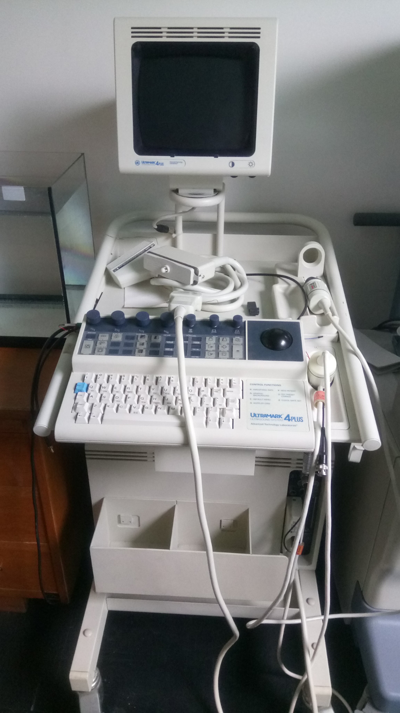

* the PVM-375AT on Nemio

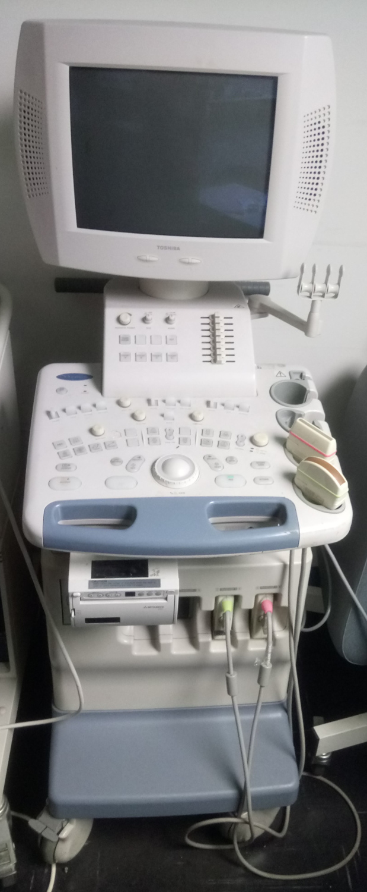

the PVM-375AT is a curved linear array with a frequency range between 3 and 6 MHz. With this probe we have made two times the resolution measurement one at 3 MHz and one at 4.6 MHz.
On these devices, the measurement was made manualy and the measurement taken with a dictaphone noting the upper limit of the resolution at the given depth.

#### Ultramark 4 plus

The resolution of this device versus the depth of measurement is given on the following image:

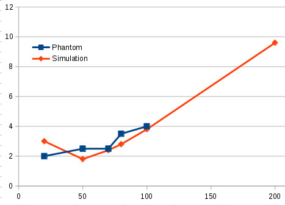

we can measure a resolution above 4 mm with our phantom, so we can’t determine the resolution above 100 mm depth. The resolution we have measure is close to the theoretical one deduce from the specs given on the ATL probe and a little bit upper. We have a resolution around 2.5 mm at the focal point. We find a resolution greater than the theoretical one maybe due to the setting of the device or maybe because there isn’t enougth line of measurement to ensure this resolution.

#### Nemio

The resolution of this device versus the depth of measurement at 3 MHz is given on the following image:

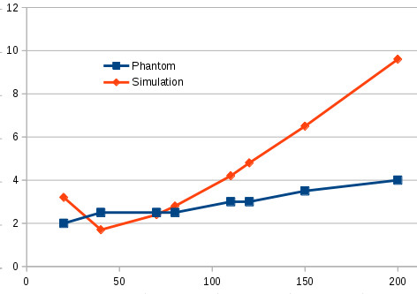

Here the resolution is between 2 and 4 mm all along the depth. Here the resolution does not widen as much as the one of the theoretical curve because with an electronical probe we can do multi-focus to have a finer focal zone all along the depth.

The resolution of this device versus the depth of measurement at 4.6 MHz is given on the following image:

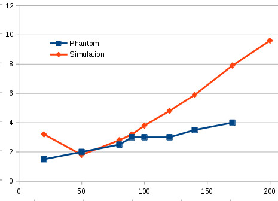

Here the minimum resolution is 1,5 mm, and go to 4 mm at 170 mm depth.

We see that, compare to device we can find on the market, a resolution of 2 mm is enougth.

## Discussion

According to our radiologist Pierre Bourrier, the area where the doctor need to have the best resolution according to the frequency of scan is:

| Frequency (MHz) | Depth (mm) |
| ------------- | ------------- |
| 3.5  | 50-150  |
| 5  | 30-105  |
| 7.5  | 10-75  |

the depth of measurement for the 5 MHz and the 7.5 MHz is rougthly a linear interpolation of the depth for the 3.5 MHz (30 ≈ 50 * 3.5 / 5) except for the beginning of the depth for the 7.5 MHz. Indeed this frequency is for superficial scanning so we need a good resolution at short distance.
The sizing of our tranducer can be made following two way, make calculation based on the ATL transducer or based on the resolution measure on the device and the depth of measurement given in the previous table.

#### ATL transducer based sizing

As we said before, we have validate the image made by the ATL probe, this mean that it’s lateral resolution is good for making acoustic imaging. We don’t use 3 MHz transducer but a 3.5 MHz one, so to size this transducer, we adjust it’s geometry to access the same focal zone. Then to size the other transducer we make a linear interpolation on the curvature radius and the resolution of the focale point. The diameter of the transducer is then adjust to fit with the resolution. We obtain:

| Frequency (MHz) | Resolution at focal point (mm) | Curvature radius (mm) | Diameter (mm) | Beggining of focal zone (mm) |
| --- | --- | --- | --- | --- |
| 3.5 | 1.6 | 60 | 12 | 30 |
| 5 | 1.14 | 50 | 9 | 25 |
| 7.5 | 0.7 | 30 | 6.4 | 17.5 |

for the 7.5 MHz transducer the beginning of the focal zone is a little bit to far corresponding to our desire depth of measurement. Note that the size of this transducer is close to one used in the ATL access C 7.5S probe.

#### Custom sizing

In this section, we size our transducer base on the resolution measured on section II. We want to have a resolution under this limit, so the best way is to have a resolution lesser than that limit at the focal point and have the focal point inside the measurement depth. So if at the beginning of the measurement depth if we search to have this limit resolution, after the resolution will decrease until it reach the focal point and then increase gradually. At each frequency, we have (by a linear interpolation):

| Frequency (MHz) | Limit resolution (mm) |
| --- | --- |
| 3.5 | 2 |
| 5 | 1.4 |
| 7.5 | 0.93 |

By trying to size the 7.5 MHz, we see that it is difficult to have a focal zone beginning at 10 mm and a good resolution for depht higher thant 50 mm. So we will take the beginning of the focal around 20 mm that correspond to the linear interpolation of the one of the 3.5 MHz. Considering that we want a mechanical probe, this is not absurd because the transducer will be in an oil bath, so the distance between the transducer and the skin and the patient will be around 10-20 mm so the focal zone will beginning close to the skin of the patient. Then we obtaine:

| Frequency (MHz) | Resolution at focal point (mm) | Curvature radius (mm) | Diameter (mm) | Beggining of focal zone (mm) |
| --- | --- | --- | --- | --- |
| 3.5 | 1.84 | 90 | 14 | 45 |
| 5 | 1.18 | 55 | 10 | 30 |
| 7.5 | 0.75 | 35 | 7 | 21 |

this sizing of transducer give geometries closed to ones sized from the ATL probe, but they have the advantage to be preciser in the depth of interest. In response we can’t do imaging when the depth is under of the depth of interest.
Note that even by using this method of sizing that give a more colimated beam, we still have a bigger resolution thant the electronic probe for deep imaging. It is not shown here, at 200 mm depth, the 3.5 MHz transducer has a resolution around 6.5 mm whereas it’s around 4 mm for the electronic probe measured on section IV.

## Conclusion

We have seen in this document that the transducers use in a commercial ultrasound scanner at 3 MHz have a resolution of 1.6 mm at the focal point (40 mm depth) and that resolution goes up to 10 mm at 200 mm depth.

By measuring the resolution of two commercial scanner, we show that a resolution around 2 mm is enough for abdominal imaging even for an electronic probe.

We have make two sizing for our transducers, when based on the geometry of the transducers present in the ATL probe, and one based on the resolution measured on the ultrasound scanners. The diameters of the transducers vary from 7 to 14 mm. The safer sizing is the one based on the ATL probe because they are based on transducer used on commercial system. The sizing based on the measured resolution must give preciser images but can’t do image at small depth, so it can disturb the doctors.