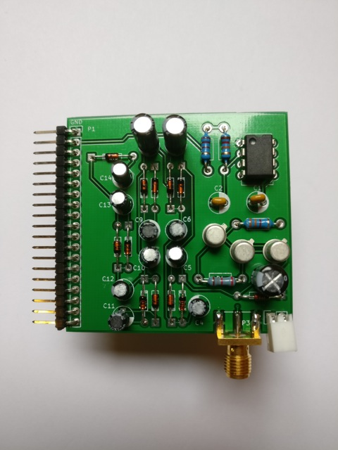
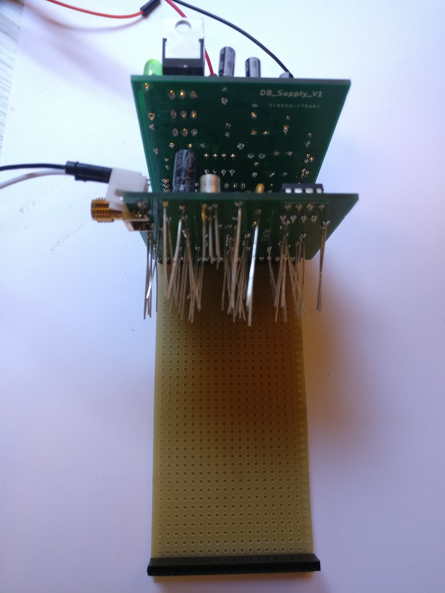
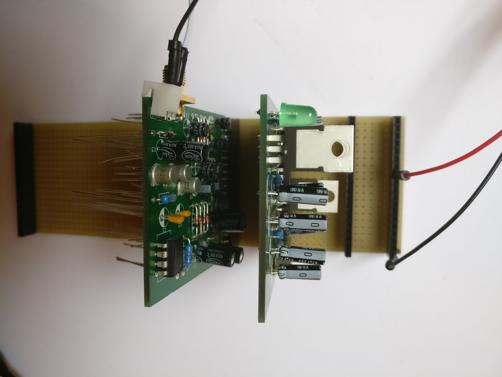
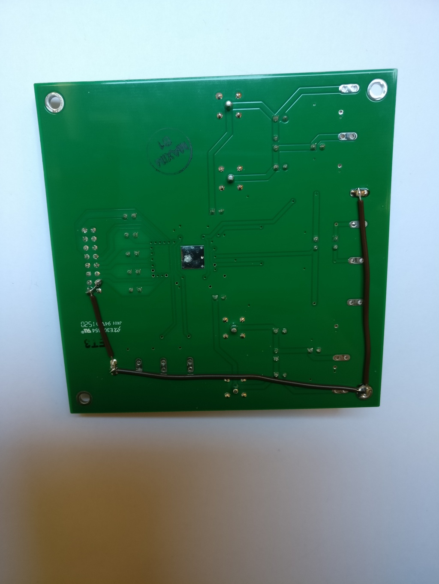
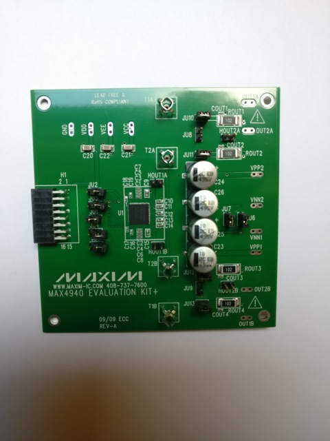

# Download repo github : prj\_medtec-kit

AJOUTER UN SCHÉMA D’ATTRIBUTION DES PISTES

## **Mother board**

Ref : RS 528-0661

39 vertical tracks

{width="5.763888888888889in"
height="7.685416666666667in"}

we need 19 tracks cut on the track of the middle

couper avec une dremel/massicot puis ébavurer

{width="5.763888888888889in"
height="7.685416666666667in"}

{width="5.763888888888889in"
height="7.685416666666667in"}

{width="5.763888888888889in"
height="4.322916666666667in"}

*Sockets :*

{width="5.763888888888889in"
height="4.322916666666667in"}

to plug daughter boards on mother board

9 sockets of size 1x19

-   first socket on one border (1) for power supply

-   second socket on (6)

{width="5.763888888888889in"
height="4.322916666666667in"}

## **Power supply**

BOM :
<https://github.com/echopen/PRJ-medtec_kit/blob/master/electronic/daughter_boards/DB-supply/DB-supply_v1/src/DB-supply_v1.csv>

PCB : DB\_Supply\_v1 (custom echOpen)

Locations of each component are indicated on the PCB

{width="5.763888888888889in"
height="4.322916666666667in"}

Capacitors : they are polarized white side corresponds to lowest
potential and must be plugged on white part of the mark on the PCB

{width="5.763888888888889in"
height="7.685416666666667in"}

Integrated circuits : the dot on the component must be plugged where
there is a « line break » (see below for direction)

{width="5.763888888888889in"
height="7.685416666666667in"}

Voltage regulator : must be plugged according to the mark on the PCB,
i.e. additionnal rectangle corresponds to the part of the voltage
regulator that has an « excroissance »

{width="5.763888888888889in"
height="7.685416666666667in"}

LED : see scheme below to identify the cathode

{width="5.763888888888889in"
height="4.240972222222222in"}

On the PCB, there is an additionnal line where the cathode must be
plugged

Transistor : faire correspondre la languette avec l’empreinte

{width="5.763888888888889in"
height="7.685416666666667in"}

*Diode*

{width="5.75in"
height="7.708333333333333in"}Faire attention au sens. Un trait marque le
bon coté, on retrouve ce trait sur l’emprunte du PCB

*REsistors : Tableau code couleur ?*

En cas d’erreur, utiliser la tresse à dessouder pour enlever l’étain.
Pour cela poser la tresse sur la soudure puis venir appliquer le fer à
souder par dessus. Forcer un peu sur les pattes pour décrocher le
composant retenu par l’étain résiduel.

{width="5.75in" height="7.708333333333333in"}

Tous les composants sont désormais en place !

*TEST DE LA CARTE*

La carte que l’on vient de construire est une carte d’alimentation qui
fournie plusieurs tensions continues stabilisées. Il convient de la
tester en l’alimentant correctement et en vérifiant que les tensions en
sortie soient les bonnes. Pour ce qui est de l’alimentation on utilisera
de préférence une alimentation de laboratoire qui présente l’avantage
d’intégrer une protection contre un éventuel court circuit.
{width="5.75in" height="7.708333333333333in"}On
choisit le mode générateur de tension idéal (C.V) et une tension de 18V
(qui correspond aux deux piles de 9V qui alimenteront le circuit) et on
limite le courant à 800mA. {width="5.75in"
height="7.708333333333333in"}On branche cette alimentation dans les pins
1 et 12 (GND et 18V).
{width="5.763888888888889in"
height="7.680555555555555in"}Lorsque l’on allume l’alimentation un
courant de 45mA doit s’établir.
{width="5.763888888888889in"
height="4.305555555555555in"}Ensuite on mesure les tensions entre la
terre (pin 1 i.e. GND) et les des pins 2, 6, 8, 18 et 19. Pour cela un
voltmètre suffit (un oscilloscope peut aussi être utilisé). On doit
mesurer respectivement 5, 12, -12, -5 et 3,3V. Si l’on n’obtient pas ces
résultats, il convient de vérifier que chaque composant est à sa place
et que les soudures ont bien été réalisées.

{width="5.75in"
height="7.708333333333333in"}{width="5.75in"
height="7.708333333333333in"}

Une fois la carte validée, on peut couper toutes les pattes.

## **High voltage**

BOM :
<https://github.com/echopen/PRJ-medtec_kit/blob/master/electronic/daughter_boards/DB-high_voltage/DB-high_voltage_v1/src/DB-high_voltage_v1.csv>

PCB : DB-high\_voltage (custom echopen)

SMA connector : les trois pattes doivent être superposées avec les trois
marques de la carte PCB (à l’avant) et les deux pattes se retrouvent à
l’arrière

{width="5.763888888888889in"
height="7.680555555555555in"}

Attention : vérifier que le condensateur en C14 supporte bien 100V

Carte terminée :

{width="5.763888888888889in"
height="7.685416666666667in"}

*Tests*

Attention il faut un oscillo qui supporte 100V, ou bien utiliser une
sonde d’oscilloscope qui divise la tension par 10

La masse se trouve en haut

{width="5.763888888888889in"
height="4.322916666666667in"}

On doit obtenir une tension de -90V à la sortie

## **Pulser**

This daughter uses an external pulser : the MAX4940 evaluation kit, that
is connected to the daughter via the P3 connector.

{width="5.763888888888889in"
height="7.685416666666667in"}

Intégrer chéma du MAX4940 :

<https://github.com/echopen/PRJ-medtec_kit/tree/master/electronic/modules/hardware/MDL-pulser/MDL-pulser_v2>

ATTENTION : ERREUR SUR LE SCHÉMA, VEE DOIT ÊTRE RELIÉ AU -12V DE LA
DAUGHTER, ET VCC AU +12V A CHANGER SUR LE SCHEMA

Connect the GND to pins 2 and 3 and VPP1 :

{width="5.763888888888889in"
height="7.685416666666667in"}

Plug components on the pulser daughter board. See BOM :
<https://github.com/echopen/PRJ-medtec_kit/blob/master/electronic/daughter_boards/DB-pulser/DB-pulser_v2/src/DB-pulser_v2.csv>

Connect the MAX4940 to the daughter board as shown below :

Tests
