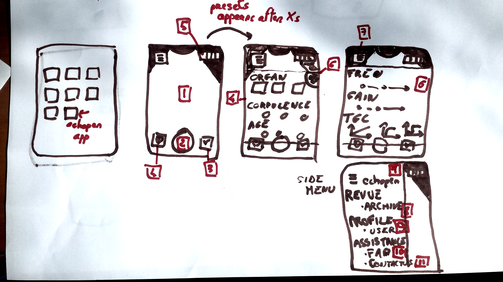

UX Design

1. **Full screen streaming images**, *At loading, the user sees immediatly the image under Fast Echo standard configuration*

2. **Image capture actions** (in case  there is no button on the probe)

    a. single tap - capture a single image under JPEG format

    b. double tap capture a 5 second loop of the previous images

3. **Examen validation**, a single clic allows user to end the exam *Do we need a review screen ?*

4. **Basic presets selection**, user can select the basics presets for examen review. This presets are:
    1. Organ
    2. Corpulence (slim, regular, heavy)
    3. Age (child, adulte, senior)

    This screen is displayed X seconds after the application start or can be access via the button on the bottom left.

5. **Probe status indicators**, display permanent informations on probe status (battery level, connection status)

6. **Expert presets selection**, user can select the expert presets for examen review. This presets are:
    1. Frequency(3.5, 5, 7 MHz)
    2. Gain(5 differentes gain options)
    3. TGC (5 Gain curves selectables)
    4. Greylevel dynamic (5 greylevel curves selectables)

7. **Administrative side menu**, sliding menu providing acces to image review, profile and assistance screens

