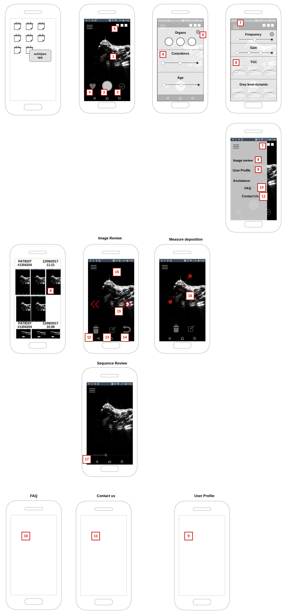
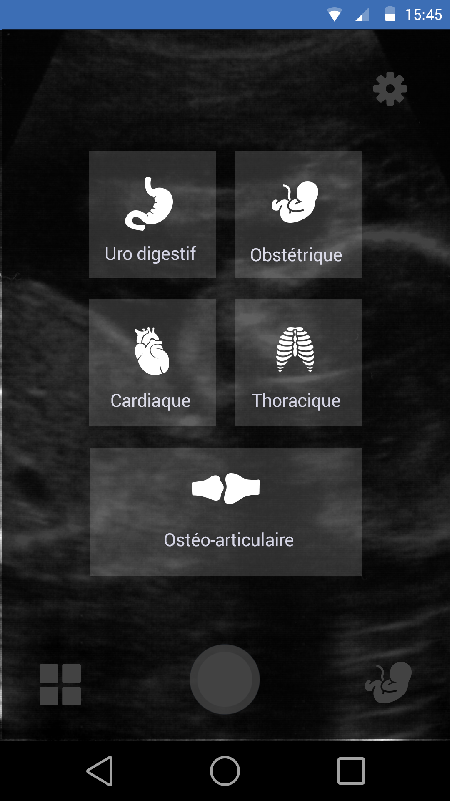

## UX Design

1. **Full screen streaming images**, *At loading, the user sees immediatly the image under Fast Echo standard configuration*

2. **Image capture actions** (in case  there is no button on the probe)

    a. single tap - capture a single image under JPEG format

    b. double tap capture a 5 second loop of the previous images

3. **Examen validation**, a single clic allows user to end the exam *Do we need a review screen ?*

4. **Basic presets selection**, user can select the basics presets for examen review. This presets are:
    1. Organ
    2. Corpulence (slim, regular, heavy)
    3. Age (baby, child, adult)

    This screen is displayed X seconds after the application start or can be access via the button on the bottom left.

5. **Probe status indicators**, display permanent informations on probe status (battery level, connection status)

6. **Expert presets selection**, user can select the expert presets for examen review. This presets are:
    1. Frequency(3.5, 5, 7.5 MHz)
    2. Gain(3 differentes gain options)
    3. TGC (3 Gain curves selectables)
    4. Greylevel dynamic (3/4 greylevel curves selectables)

7. **Administrative side menu**, sliding menu providing acces to image review, profile and assistance screens

8. **Image review gallery screen**, a gallery displaying the recorded images and loops split by Patient exam. 

9. **Profile screen**, a configuration screen to edit user profile and preferences 

10. **FAQ screeen**, a screen displaying a series of Q&A samples and adding the capability to ask a question 

11. **Contact us screen**, a screen allowing the user to reports bugs, provides feedbacks and contact the organisation

12. **Image capture management**, allows the user to delete a single image or a sequence reviewed

13. **Measure deposition**, allows the user to deposite a measure on an image during the review

14. ---

15. **Image review one by one**, allows the user to swipe to review image and sequence captured one by one.

16. **Measure edition**, allows the user to remove or edit a deposited measure

15. **Sequence review one by one**, allows the user to watch a dynamic sequence. It also provides a slider to adjust the of the image sequence display. On image by image review the display fallbacks to image review one.

##UI References

We want to develop a visual identity following the design below:

*credits: https://github.com/echopen/PRJ-medtec_androidapp_UIUX/blob/HETIC_G3/Echopen_App_HETIC_Groupe03/Exports/Echographe%20Choix%20Organe.png*

## Backend challenges

1. **Voice Commands**, control *Expert preset selection* using Voice commands in 5 languages (French, English, Spanish, Portuguese, Chinese)

2. **Data transfer protocol**, implement a medical standard compliant data transfer protocol including:
    * data encoding
    * data encryption
    * secure communcation

3. **DICOM export** implement a medical standard compliant export to DICOM ultrasound image and sequence. 
