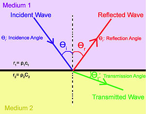
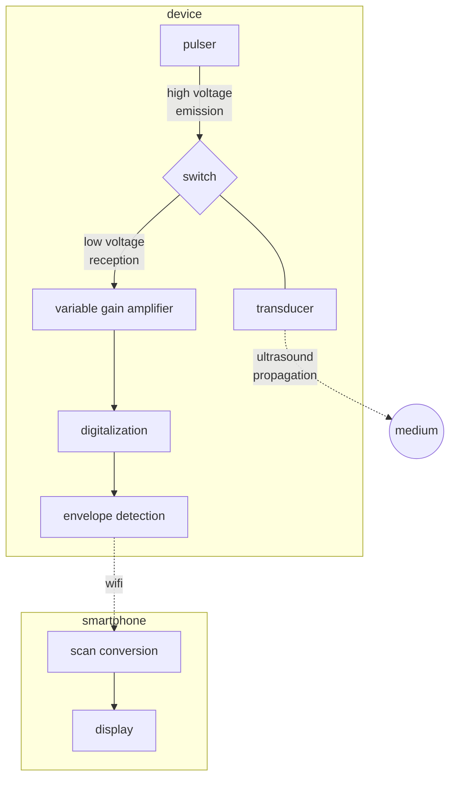

# Introduction
_This section is in construction_

## How medical ultrasound works ?

This imaging technique is based on the propagation of ultrasound in the human body in order to realize medical diagnosis. Ultrasound is sound waves at a frequency that is too high to be perceived by the human ear. It behaves as the traditional sound and it propagates a little bit like waves in the sea. 

### Using the pulse echo sequence for ranging objects 

To localize objects we use the pulse echo concept. Remember last time you yelled in a valley ? Your voice bounced on the mountains and came back to your ear after some delay. To know how far is a cliff in front of you for example the idea is to measure the time your cry takes to come back to your years. Knowing the  sound speed in air you can easily retrieve the distance as it is half the delay times the sound speed. The half factor count for the fact that our cry traveled a two way trip. A lot of animals use this principle to perform echolocation as bats or dolphins allowing them to "see with their ears". 

### Both an emitter and a receiver: the transducer

In the case of medical ultrasound, ultrasounds are emitted and received by a unique device called a transducer. This latter is made of a special material subject to a phenomenon called piezoelectricity. When a mechanical stress is applied to such a material, it reacts by accumulating electric charges. As sound is nothing else than a mechanical vibration, the sound arriving on the transducer implies a mechanical stress which is converted in a electrical tension that can be measured. The contrary is also possible. A voltage applied to the transducer will lead to a mechanical stress which will propagate as ultrasound waves through the medium we want to investigate. 

### Reflections: a matter of acoustical impedance 

Unlike echolocation that aims to locate objects from reflection on their surface, medical ultrasound aims to produce an image of a medium by making ultrasounds penetrating it. Our body is made of bones, liquids, tissues... offering a complex geometry for our waves. To understand how waves are reflected in this complex medium, we first have to understand how a wave is reflected at an ideally flat interface of different material.

At the interface between two mediums, any incident wave splits in a transmitted and a reflected wave. The ratio of the transmitted wave and the reflected is related to the difference of impedance betwenn those two mediums. The acoustic impedance of is the product of the density and the sound speed. The more the acoustical impedances of the two mediums are different, the more the wave is reflected. For example the interface between air and water is really reflective as the density of water is much superior as the one of air (while the speed of sound is five times faster in water than in the air). This explains why a gel must be applied between the probe and the body : any left air would prevent ultrasound to penetrate our skin.

<figure>
  
  <figcaption> Figure 1: Reflection at an interface.</figcaption>
</figure>

### Ultrasound imaging: a reflectivity map

Most parts of our bodies are mainly composed of water, so the acoustic impedance of our different tissues don't variate so much around the value of the one of water. As the differences of impedance are low, the body is not so reflective for ultrasounds (except for the bones). If we send ultrasounds it will be mainly transmitted and at each depth a small partially reflected wave will propagate back. The more the variation of the local acoustic impedance is important, the more the wave is reflected. This leads us to what is an ultrasound image, it is a map of the reflectivity to ultrasound. So this modality of imagery shows the interfaces. It's quite natural for our brain to think to objects by their edges so almost no further processing is needed to interpret this image.

### Assessing the origin of reflections by focusing

The delay between pulse and echo allows us to range the depth of the reflections occurring along the path of the ultrasonic pulse. But to form a proper 2D image we also need to know which direction those reflections come from. A solution to solve that problem is to focus the waves we send so that they travel along a line instead of propagating in every direction. It's the same idea than putting your hand around your mouth to direct your voice to somebody. By using acoustical lenses (that behaves the same as a classical magnifying glass but for sound) or by shaping the transducer in a parabolic way we can form a narrow beam along the which our pulse will propagate. This done, we know that the echoes we will receive will come from reflections along that line.

This improvement allows us to probe our medium line by line. An entire area has to be scanned to form an image. A way to do that is to rotate the transducer. The transducer is placed fully at left for example. A first pulse is emitted, echoes are recorded. Then the transducer is rotated just a bit and another pulse echo sequence is achieved. We repeat this process until the area of interest is swept. More modern approaches use several transducers to achieve both synthetic focusing and fast scanning with improved resolution but they are out of reach for this introduction. 

## Our solution: be simple, be low cost

We could keep talking about ultrasound imaging for hours as this technology has been under heavy development since decades. But we will stop here for the theory and go straight to the minimal hardware required to achieve an ultrasound image. More will be explained when needed. 

### A unique rotating transducer

Our solution to tackle the imaging processed is based on the first generations of scanners because of their simplicity. Those scanners contained only one rotating transducer. To gain versatility, probes were usually embedding several transducers as a unique transducer design couldn't fit all imaging purposes.

### The minimal acquisition chain

To summarize the process of acquisition we first have to place the transducer in the right position thanks to a motor.Then, a circuit called a pulser is used to excite the transducer. Once this is done, the transducer is switched onto a listening mode. The signal is amplified by a variable gain amplifier as signal coming from deeper reflection need to be further amplified because of the attenuation of ultrasound in human tissues. The signal is then digitalized and some processing is achieved to extract the envelope as it is the relevant information we want to display. Some denoising can be applied at this step. The collected lines are then sent to the smartphone via wifi where the scan conversion is achieved. This last step consists in rendering a conical image from the different recorded lines. 

Here a simplified flowchart of the full device. Click any part to learn more about it !

## Scan conversion

The Scan Conversion allows one to recreate a clinical image from a set of data sent by a probe. The received image depends on the geometry of the probe. This process intends to recreate the 'real' image.

Using an ultrasound beamformer, we can scan an area line by line and gather data about each depth. Those data are collected and written in a chart. So each column contains data that have been collected for a particular direction, at different depths. If a color is attributed to each cell of the chart, a rectangular image is obtained. But as a column of the chart corresponds to a direction and not to a vertical line a distorded image is obtained. This means that a polar to cartesian scan conversion is necessary before display.

 A combined design scheme for polar to Cartesian scan conversion using nearest neighbor and linear interpolations has been implemented which optimizes both image quality and hardware requirement. The nearest neighbor interpolation is a simple method although it makes the image blocky. On the other hand, linear interpolation needs a few computations but is free from these artifacts in the far field. At the end of that process, we obtain a better representation of the reality.

<figure>
  
  <figcaption> Figure 1: Reflection at an interface.</figcaption>
</figure>

<figure>
  
  <figcaption> Figure 1: Reflection at an interface.</figcaption>
</figure>

Indeed, the probe stores a series of sampled scan-lines, whatever the geometry of the scanned area.

Which can be represented with clinical images such as :

  

These two images are before/after scan conversion of an image of a liver
