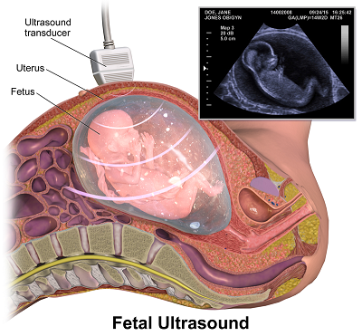
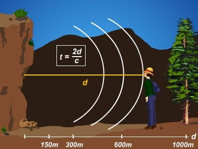
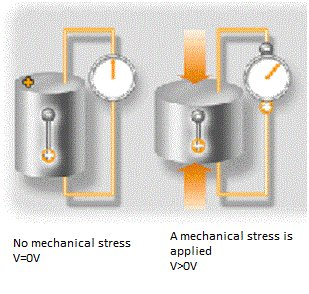
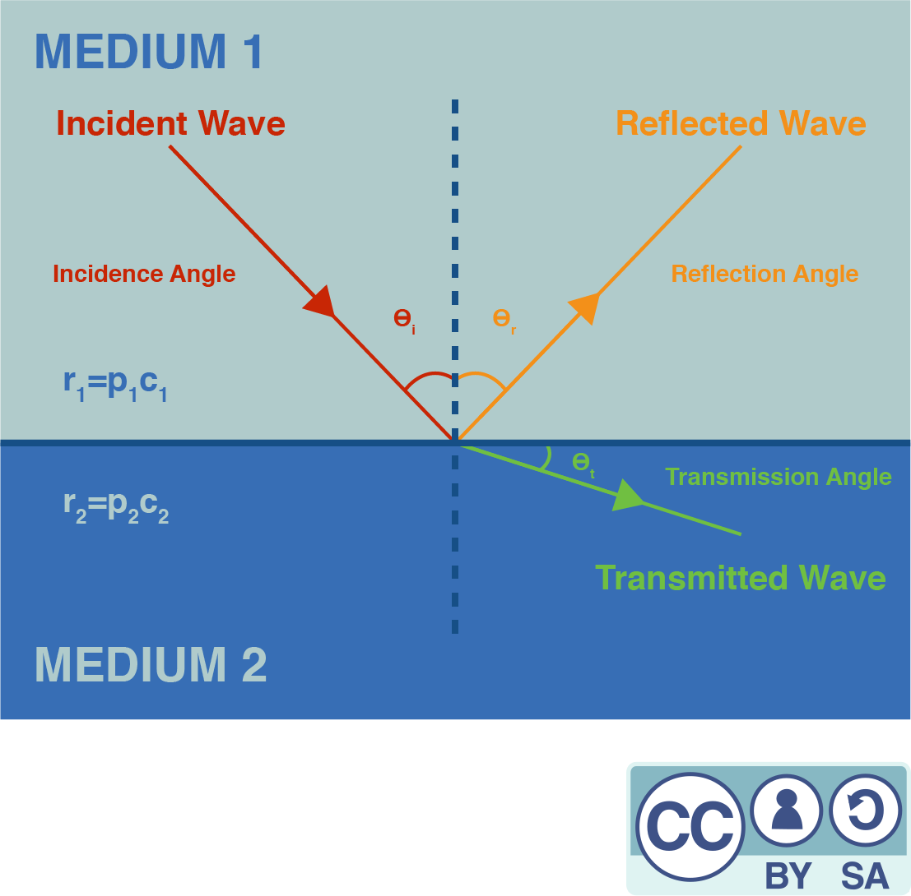
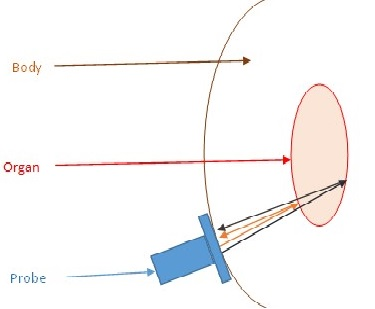
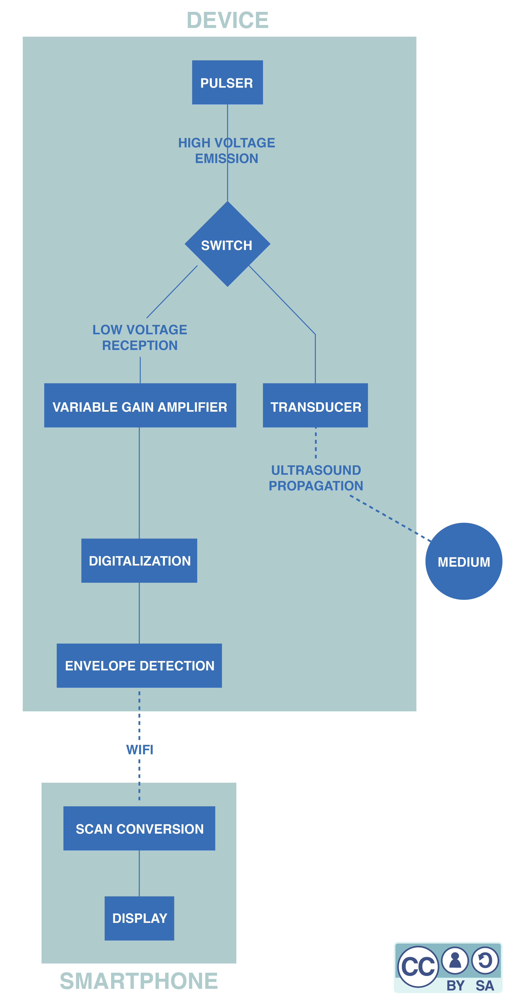
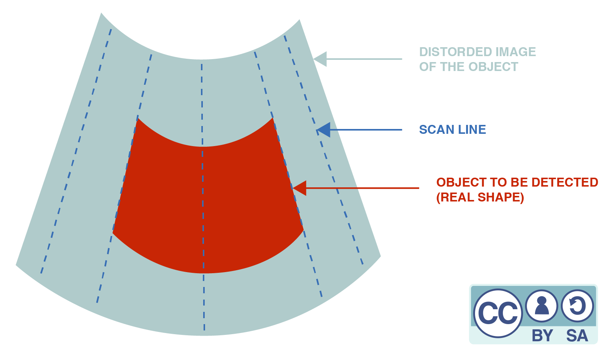
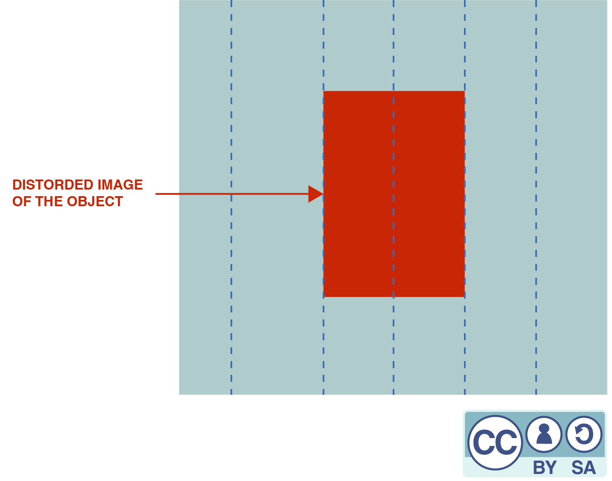

# Technical introduction
_This section is in construction_ 

## How medical ultrasound works ?

This imaging technique is based on the propagation of ultrasound in the human body in order to realize medical diagnoses. Ultrasound is sound waves at a frequency that is too high to be perceived by the human ear. It behaves as the traditional sound and it propagates a little bit like waves in the sea. 

<figure>
  
  <figcaption> Figure 1: Fetal ultrasound
  
  Image source: https://upload.wikimedia.org/wikipedia/commons/thumb/e/ee/Fetal_Ultrasound.png/800px-Fetal_Ultrasound.png</figcaption>
</figure>

### Using the pulse echo sequence for ranging objects 

To localize objects we use the pulse echo concept. Remember last time you yelled in a valley ? Your voice bounced on the mountains and came back to your ear after some delay. To know how far is a cliff in front of you for example, the idea is to measure the time your cry takes to come back to your ears. Knowing the speed of sound $$c$$ in air you can easily retrieve the distance $$d$$ as it is half the delay $$t$$ times the sound speed. The half factor count for the fact that the cry traveled a two way trip. Many animal species such as bats or dolphings use this principle to perform echolocation, allowing them to "see with their ears". 

<figure>
  
  <figcaption> Figure 2: Reflection of sound on a cliff
  
  Image source: http://www.larousse.fr/encyclopedie/divers/%C3%A9cho/45456</figcaption>
</figure>

### Both an emitter and a receiver: the transducer

Medical ultrasound signals are emitted and received by the use of a single device called a transducer. The transducer is made of a special material subject to a phenomenon called piezoelectricity. When a mechanical stress is applied to such a material, it reacts by accumulating electric charges. As sound is nothing else than a mechanical vibration, the sound arriving on the transducer implies a mechanical stress which is converted in a voltage that can be measured. The contrary is also possible. A voltage applied to the transducer will lead to a mechanical stress which will propagate as ultrasound waves through the medium we want to investigate. For simplicity a transducer can be seen as a speaker and a microphone at the same time, only it emits and detects ultrasounds.

<figure>
  
  <figcaption> Figure 3: The piezoelectric effetc
  
  Image source: http://www.tech-faq.com/piezoelectric-effect.html</figcaption>
</figure>

### Reflections: a matter of acoustical impedance 
Unlike echolocation that aims to locate objects from sound reflection on their surface, medical ultrasound aims to produce an image of a medium by making ultrasounds penetrating it. Our body is made of bones, liquids, tissues... offering a complex geometry for our waves. To understand how waves are reflected in this complex medium, we first have to understand how a wave is reflected at an ideally flat interface between two different materials.

At the interface between medium _A_ and medium _B_ (see Figure 4), any incident wave splits in a transmitted and a reflected wave. The ratio of amplitudes of the transmitted and the reflected wave is related to the difference of impedance between the two mediums. The acoustic impedance $$Z$$ of a medium is given by the formula $$Z=\rho{c}$$ where $$\rho$$ is the medium density and $$c$$ the sound speed. The ratio $$r$$ between the amplitudes of the reflected and the incident wave is given by: 

$$r=\frac{Z_2\cos(\theta_i)-Z_1\cos(\theta_t)}{Z_2\cos(\theta_i)+Z_1\cos(\theta_t)}$$

So, the larger the difference between the two acoustical impedances of the two mediums, the greater the fraction of the wave that gets reflected. For example, the interface between air and water is really reflective, as water density is much greater than air density (while the speed of sound is five times faster in water than in air). This explains why a gel must be applied between the probe and the body : any left air would prevent ultrasound from penetrating our skin.

<figure>
  
  <figcaption> Figure 4: Reflection at an interface
  
  Graphic design by Jason Madelénat
  </figcaption>
</figure>

### Ultrasound imaging: a reflectivity map

Most parts of our bodies are mainly composed of water, so the acoustic impedances of our various tissues do not differ much from that of water. As the differences of impedance are low, the body is not so reflective for ultrasounds (except for the bones). If we send ultrasounds it will be mainly transmitted and at each depth only a small partially reflected wave will propagate back. The greater the variation of the local acoustic impedance, the more the wave is reflected. This leads us to what is an ultrasound image : a map of the reflectivity to ultrasound. Using this modality of imagery thus allows to better exhibit the interfaces. It's quite natural for our brain to think about objects in terms of their edges, so almost no further processing is needed to interpret this image.

<figure>
  
  <figcaption> Figure 5: echolocation in the human body</figcaption>
</figure>

At time $$t_0$$, some ultrasounds are emitted by the transducer which is located in the probe. A part of them gets reflected at the first interface between the organ and the other tissues, then propagates back and is detected by the transducer at a later time $$t_1$$. Another part of the ultrasounds is reflected on the second interface and is detected at time $$t_2$$. The position of these interfaces can be calculated knowing the speed of sound in the human body.

<figure>
  
</figure>

### Assessing the origin of reflections by focusing

The delay between pulse and echo allows us to range the depth of the reflections occurring along the path of the ultrasonic pulse. But to form a proper 2D image we also need to know which direction these reflections come from. A solution to solve this problem is to focus the waves we send so that they travel along a line instead of propagating in every direction. It's the same idea than putting your hand around your mouth to direct your voice to somebody. By using acoustical lenses (that behaves the same as a classical magnifying glass but for sound) or by shaping the transducer in a parabolic way we can form a narrow beam along which our pulse will propagate. By doing so, we know that the echoes we will receive will come from reflections along the emission line.

This improvement allows us to probe our medium line by line. An entire area has to be scanned to form an image : a way to do this is to rotate the transducer. For example, let's assume we begin by placing the transducer fully to the left. A first pulse is emitted, echoes are recorded. Then the transducer is rotated just a bit and another pulse echo sequence is achieved. We repeat this process until the area of interest is swept. More modern approaches use several transducers to achieve both synthetic focusing and fast scanning with improved resolution but they are out of reach for this introduction. 

## Our solution: be simple, be low cost

We could keep talking about ultrasound imaging for hours as this technology has been under heavy development since decades. But we will stop here for the theory and go straight to the minimal hardware required to achieve an ultrasound image. More will be explained when needed. 

### A unique rotating transducer

Our solution to tackle the imaging process is based on the first generation of scanners because of their design simplicity. These scanners contained only one rotating transducer. To gain versatility, first generation probes would usually embed several transducers, as a single transducer design couldn't fit all imaging purposes.

### The minimal data acquisition system

Data acquisition is the process of sampling signals that measure real world physical conditions and converting the resulting samples into digital numerical values that can be manipulated by a computer. At echOpen, we try to use as few components as possible in the data acquisition system in order to reduce the cost of our probe. Let's follow the signal through that system:
* First, the transducer is put on the right position thanks to a motor.
* A circuit called a pulser is used to excite the transducer that behaves like a speaker. 
* The transducer is switched onto a listening mode (it then behaves like a microphone). 
* The signal is amplified. This step is necessary to digitalize the signal, otherwise its amplitude would be too low.
* The signal is digitalized.
* Some processing is achieved to extract the relevant information we want to display. This is called envelope extraction. Some denoising can be applied at this step. 
* The collected lines are sent to the smartphone via wifi. 
* The scan conversion is achieved. This last step consists in rendering a conical image from the different recorded lines. 

Here is a simplified flowchart of the full, device and a little more information about each component:

<figure>
  
  <figcaption> Figure 4: Flowchart of the echOpen device
  
  Graphic design by Jason Madelénat
  </figcaption>
</figure>

#### The pulser

The pulser is an electronic board that converts a logic signal that ranges from 0-3.3V into an analog one that ranges from -100V to 0V. This high voltage analog signal is needed to allow the transducer to emit ultrasounds.

#### The transducer and the switch
The transducer converts an electrical signal into ultrasounds thanks to the piezoelectric effect: an alternating current is applied across the piezoelectric crystal that grows and shrinks depending on the voltage applied. The alternating current makes the crystal vibrate quickly, which produces an ultrasound. After reflection, the sound hits the crystal and triggers the reverse piezoelectric effect. An electronic signal containing information about the reflections of the ultrasound waves is obtained.

#### The variable gain amplifier

In complex mediums (such as the human body) waves are attenuated. It means that their amplitude decreases all along their way. As a consequence, ultrasounds that were reflected deeper in the body arrive at the transducer with a lower amplitude and need to be amplified (remember that they also arrive later at the transducer). The variable gain amplifier is an electric component that amplifies the signals received by the transducer depending on their order of arrival. 

#### Digitalization
After the amplification, the signal is still analog. It needs to be digitalized (converted into a logical signal) to be processed by other electronical components.

#### Envelope detection
The envelope detection is a procedure that is used to analyse the signal to detect the times at which reflected ultrasounds were received. It can be done with an analog or a digital signal. We chose the latter option. For the moment this detection is realized thanks to the smartphone application, but our plan is to be able to do it inside the device. Indeed, performing envelope detection in the smartphone requires to send the complete signal by WiFi to the smartphone, which we would like to avoid.

#### Scan conversion

The scan conversion allows one to recreate a clinical image from a set of data sent by a probe. The received image depends on the geometry of the probe. This process intends to recreate the 'real' image.

Using an ultrasound beamformer, we can scan an area line by line and gather data about each depth. These data are collected and written in a chart. So each column contains data that have been collected for a particular direction, at different depths. If a color is attributed to each cell of the chart, a rectangular image is obtained. But as a column of the chart corresponds to a direction instead of a vertical line, a distorded image is obtained. This means that a polar-to-Cartesian scan conversion is necessary prior to the display.

 A combined design scheme for polar to Cartesian scan conversion using nearest neighbor and linear interpolations has been implemented which optimizes both image quality and hardware requirement. The nearest neighbor interpolation is a simple method although it makes the image blocky. On the other hand, linear interpolation needs a few computations but is free from these artifacts in the far field. At the end of that process, we obtain a better representation of the reality.
 
 

<figure>
  
  <figcaption> Figure 6: Scheme of a scanned area
  
  Graphic design by Jason Madelénat
</figcaption>
</figure>

<figure>
  
  <figcaption> Figure 7: Image obtained without polar-to-Cartesian conversion
  
  Graphic design by Jason Madelénat
</figcaption>
</figure>

After polar-to-Cartesian scan conversion, the object is displayed on the screen according to its real shape, which can be represented with clinical images such as :

  

These two images are before/after scan conversion of an image of a liver

## Looking for further information ?

To learn more about the hardware of the latest version of the device, click [here](/stable/doc_hardware.md).

To learn more about the software, click [here](/stable/doc_software.md)

# List of authors
[Alister Trabattoni](https://github.com/halipster)
[Apolline Faidherbe](https://github.com/ApollineF)
[Jason Madelénat](https://jasonmadelenat.wordpress.com/)
[Nicolas Filipovic](https://github.com/nfilipov)
