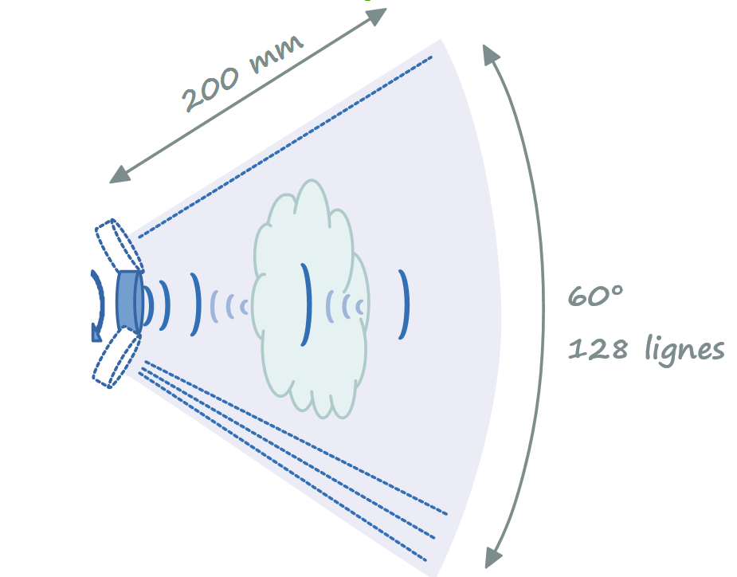
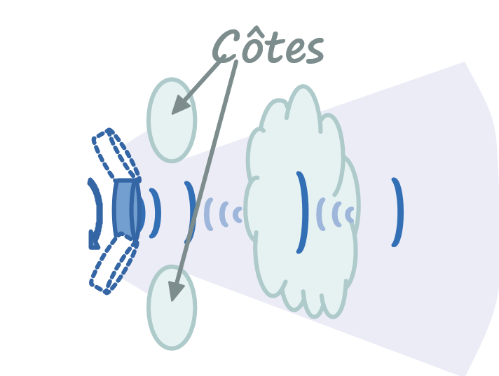
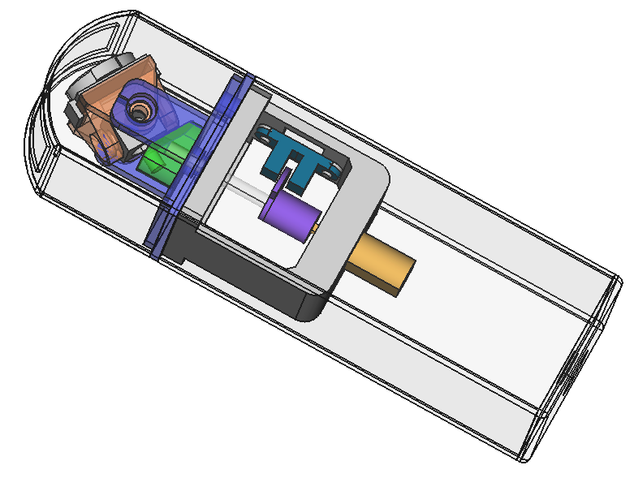
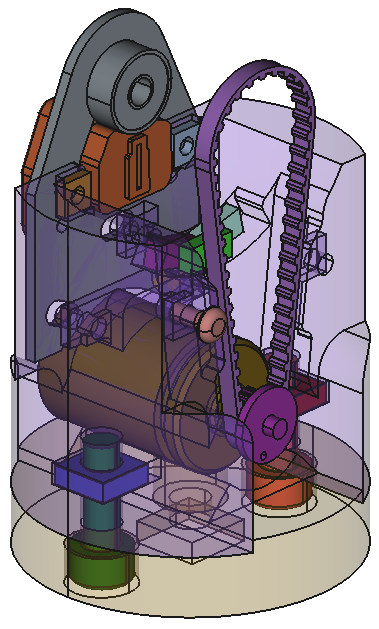
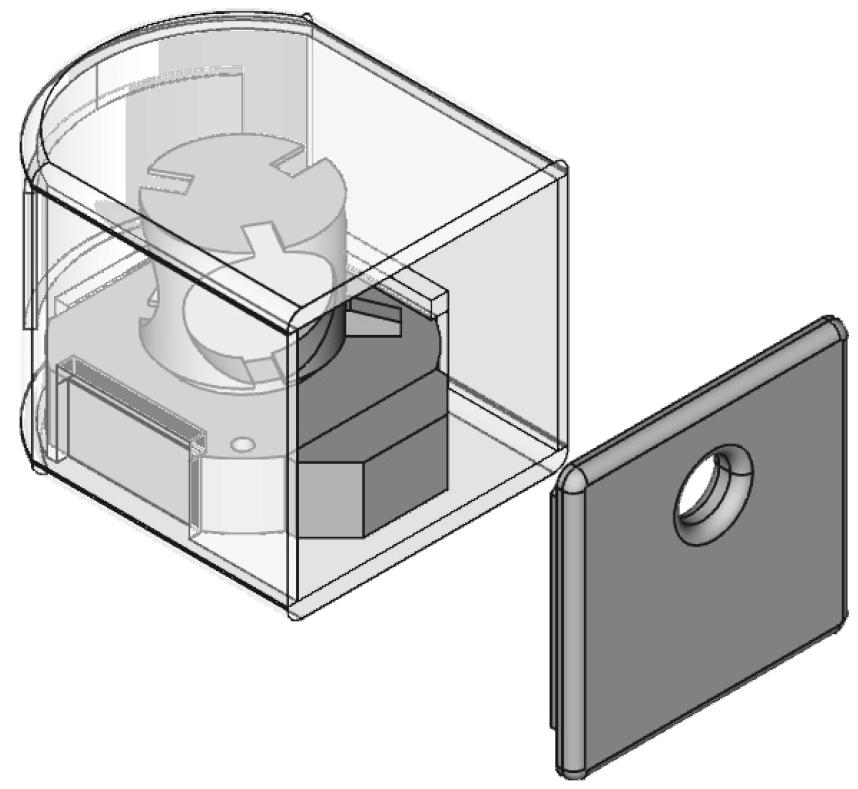
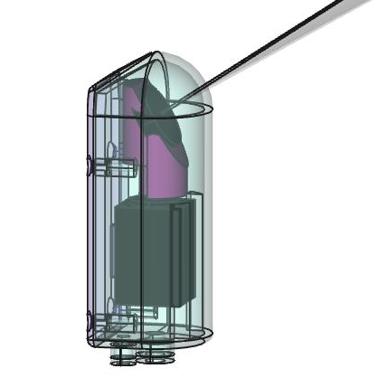

# Mechanical issues 

As part of the echOpen project, the study and realization of the ultrasound probe raises a number of mechanical and technological problems to be dealt with bearing in mind the specificities of the project: *fabricability*, low cost, robustness , Maintainability, open-source ... We will not deal here with problems related to ultrasonic transducers.

Some orders of magnitude
------------------------

Approximate magnitudes of some interesting physical values in the case of a resonant transducer 3.5MHz.

| Magnitude                                      | Value    | Comment                                                          |
|------------------------------------------------|----------|------------------------------------------------------------------|
| Sound speed in water                           | 1540 m/s |                                                                  |
| Swept Sector                                   | 60 °     |                                                                  |
| Depth                                          | 200 mm   |                                                                  |
| Number of lines                                | 128      |                                                                  |
| Transverse resolution                          | 1 mm     | Wish                                                             |
| Ultrasonic Frequency                           | 3.5 MHz  | We will also have to use piezo at 5 MHz and 7.5 MHz.             |
| US Wavelength at 3.5 MHz                       | 0,44 mm  |                                                                  |
| Longitudinal Resolution                        | 1 mm     | Wish (dependent on the US wavelength in water).                  |
| Fps                                            | 15 fps   |                                                                  |
| Angular res. between lines                     | 0,47 °   |                                                                  |
| Nb line / rotation                             | 768 l/tr | To choose position encoder.                                      |
| Motor speed in alternating rotation            | 480 rpm  | 7.5 rot / s. Regardless of a possible gearbox.                   |
| Motor speed in continuous rotation             | 960 rpm  | 15 rot / s. Regardless of a possible gearbox.ur.                 |
| Lateral resolution at 100mm depth              | 0.82 mm  | Compatible with the desired resolution (but not at 200mm).       |
| Excitation pulse duration                      | 142 ns   | half period at 3.5 MHz (to be refined).                          |
| Return time echo at 200mm depth                | 260 µs   | 2 times the wave travel time for 200 mm.                         |
| Return time for a 1 mm detail                  | 1,3 µs   | The smallest time detail to measure on the envelope.             |
| Minimum time for one frame                     | 33 ms    | 260 µs x 128 lines.                                              |
| Theorical maximum fps in alternating rotation  | 30 fps   | For a transducer placed on an oscillating device at ± 30 °.      |
| Theoretical maximum fps in continuous rotation | 5 fps    | For a transducer placed on a drum driven in continuous rotation. |
| Maximum motor speed in alternating rotation    | 480 rpm  | Regardless of a possible gearbox.                                |
| Maximum motor speed in continuous rotation     | 300 rpm  | Limited by the theoretical maximum fps (960 rpm otherwise).      |

Scanning function
-----------------

This is the primary function of the mechanical device: to scan a sector of 60 ° to the normal to the emitting surface of a piezoelectric transducer.

Two main approaches have been tested or considered:

-   **Oscillating motion** : by transforming the rotary motion of a motor into ± 30° oscillations , with a stepper motor in an alternative motion or with a resonant magnetic (or piezo) system.

    -   **Problem** : irregular motor torque, vibrations at 7 Hz (possibly balanced).

-   **Continuous rotary motion** : the transducer is placed on a rotary drum driven by a motor.

    -   **Problem** : the electrical connection (pulse Tx and signal Rx) with the rotating transducer is complex. Limited to 5 fps maxi, except tip as the interlacing..

-   **Idea** : a rotating flat surface could play the role of an acoustic mirror.

Whatever the approach, the system requires accurate knowledge of the angular position (every 0.47 °) of the transducer to trigger the firing. Two approaches were considered: 

-   **A fine control of the rotation speed** of the motor, associated with an absolute reference top per rotation, the firings being triggered at fixed date.

    -   **Problem** : Difficult control in the case of an oscillating mechanism due to variations in torque (two accelerations / decelerations per revolution).

-   **A stepper motor** (so an open-loop control) whose position is known at all times as long as the engine torque is sufficient. A top-by-turn at initialization allows to fix the absolute reference position. The motor can be used in direct drive or with gearbox.

    -   **Problem** : Engine more expensive and noisier than a DC motor.

**Idea** : A resonant system (electro-mechanical or piezoelectric) whose position would then follow a sinusoid phase-shifted by a constant value with respect to the excitation signal. A brushless torque motor could also be used.

In all these cases, encoder systems (absolute and incremental) are necessary to calibrate the shots. Care should be taken to limit errors due to mechanical backlash by placing them as close as possible to the transducers in the mechanical chain.

**Note** : in order to facilitate certain medical examinations, in particular between two close ribs, it is preferable to approach as much as possible the transducer of the end of the probe tip in contact with the body. Indeed, if the transducer is located closer to the body, the angle of the sector swept between the two ribs is larger.

### Tri-frequency probe

The medical need requires us to work at 3 different frequencies (3.5 MHz, 5 MHz or 7.5 MHz).

Ideally we have to move in the probe 3 transducers of different characteristics that will be selected electronically from the smartphone. They can be placed at 120 ° on a rotating drum.

**Problem** : Moving masses and larger dimensions. A system to select wich transducer will be active at one time.

**Idea** : Removable low-cost transducer to be manually changed.

**Note** : Whatever the chosen movement (oscillating or rotating) the electrical coupling of the transducers and the electronic card will require special attention. In the case of the oscillating system, 3 shielded wires wound in spiral must follow the movement while presenting a good resistance to wear. In the case of continuous movement, a rotary coupler (mechanical or magnetic) must transmit the signal without degrading it.

Ultrasonic Transparency
-----------------------

In order that the transmission of the ultrasound is not disturbed by the changes in interface between the different media traversed, the materials used must have an acoustic impedance close to that of the human body and therefore water.

-   **A gel** is used between the body and the tip of the probe: find simple and economical recipes to make this gel.
-   **The material of the probe** : polyurethane seems to be a candidate to consider.

    -   **Problem** : If the rest of the probe is in another material the junction probe / tip is to be sealed (glued or removable).

-   **The transducer must be immersed in liquid medium**. This ensures good acoustic coupling between transducer and external environment. Flax or sunflower oils are potential candidates. Several options are possible to isolate the oil immersed area from the inside of the probe: flexible membrane pinched between the base of the transducer and the probe tip, lip seal on the motor shaft (very energy-intensive) or Transducer and engine bathing in oil (the engine must be functional in oil) ...

    -   **Problem** : A filling system must be provided to eliminate any air bubbles. The liquid must have no toxicity for the users, be insulating, non-corrosive for submerged parts (otherwise it would have put water ...), minimum viscosity and easy to supply.

Shape and ergonomics
--------------------

A design study will allow to explore with the physicians the shapes that will be compatible with the gestures to be realized during the examination.

The probe must have a certain degree of sealing (to be defined), a minimum of asperity to facilitate a careful cleaning. However, it must be easily dismountable without losing its sealing characteristics. The screws are probably the most suitable means of maintenance. It will also be necessary to provide for the leak tightness of the screws.

Connections with the outside
----------------------------

We want to minimize the connections with the outside. Some interactions to be expected:

-   **On/Off** with possibly a very low power standby
-   **User interface** using LEDs and capacitive buttons through the shell. It is also possible to detect movement or tapping.
-   **Probe/smartphone communication** : the connection between the two elements must ensure maximum reliability and robustness. Possibilities: wifi, bluetooth, wired, ...
-   **Charging the battery** by induction or by μUSB connector and a watertight plug. A charging dock would be interesting.
-   **Wi-Fi pairing** : without contact with NFC for example.

Energy, autonomy
---------------

Ideally, the probe should be autonomous in terms of energy and ensure an operating life compatible with the intended use. For example 3 min every 20 min (to be specified). Several options:

-   **The probe has a rechargeable battery**.

    -   **Problem** : Battery capacity, lifetime and danger are to be considered (Li-ion, LiPo or LiFePO4)

-   **The power supply box is separated** and connected by a 1m cable to the probe.

    -   **Problem** : Less practical to handle but to consider in case of technical impossibility to place the batteries in the probe. Also offer the possibility of having several batteries. The connection between the cable and the probe will be permanent and watertight.

-   **The probe is connected to the smartphone** and takes its energy.

    -   **Problem** : It seems that any physical connection of the probe to an external device during the examination also obliges us to extend the medical certification to this device. Unthinkable for personal smartphone.

**Note** : Particular attention will be paid to possible thermal problems during use as well as when recharging the battery.

Impact resistance
-----------------

The probe must be sturdy and withstand a fall from a height of about 1 m (examination bed) on tiles. After this kind of shock, the hull must remain watertight, functional internal mechanics and the most dense parts (batteries) stay in place.

