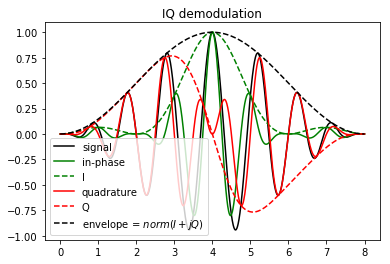
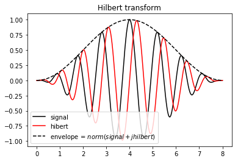
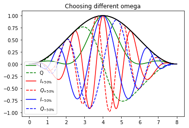

# $IQ$ Demodulation and Hilbert Transform  

When dealing with medical signals the relevant representation we want to assess is a decomposition in two terms :
$$
s(t) = \underbrace{a(t)}_{envelope}cos(\underbrace{\phi(t)}_{instantaneous\space phase})
$$
The envelope $a(t)​$ carries the energy of the signal and slowly variates in relation to a carrier term which quickly oscillate according to the instantaneous phase $\phi(t)​$. Where the envelope is used to perform B-Mode imaging, the instantaneous phase is used for Doppler imaging. 

The two main approaches to assess this representation are : $IQ$ (quadrature) demodulation which outputs an $IQ$ representation of the signal, and, Hilbert transform that give the analytic signal which is another complex representation. Those two are closely related and come from two words. The $IQ$ one come from the analog domain as it can be obtain with some mixers and low pass filters. The analytic signal comes from a more mathematical approach and is difficult to produce in the analog domain. 

We will talk about both processes and representations in this paper, don't mix $IQ$ demodulation with $IQ$ representation. The first leads to the second. Accordingly Hilbert Transform is the process that permits to form the analytical signal. But we will also see that we can use the Hilbert Transform to assess the IQ representation and the IQ demodulation to assess the analytic signal.

## $IQ$ Representation 

This representation comes from telecommunication were signals of interest are modulated by a sinusoid of known frequency. In the case of ultrasound, the signal is not as frequency centered but the technique still works. By assuming the central frequency $\omega$ we can decompose the instantaneous phase as following :
$$
\phi(t) = \omega t + \theta(t)\\ s(t) = a(t) cos(\omega t  + \theta (t) )
$$
Here $\theta(t)$ is the phase and slowly variates in relation to $\omega t$. Thanks to some trigonometric formula this can be rewritten as :
$$
s(t) = \underbrace{\overbrace{a(t)cos(\theta(t))}^{I(t)}cos(\omega t)}_{in-phase} -\underbrace{\overbrace{a(t)sin(\theta(t))}^{Q(t)}sin(\omega t)}_{quadrature}
$$
This decomposition split the signal in two terms. One term in $cos(\omega t)$ which is called in-phase component as originally we wrote the signal with the $cos$ function. Another term in $-sin(\omega t)$ which is the quadrature component since $-sin$ is the quadrature of $cos$. We then define $I(t) = a(t)cos(\theta(t))$ and $Q(t) = a(t)sin(\theta(t))$ allowing us to rewrite the former expression as : 
$$
s(t) = I(t)cos(\omega t) - Q(t)sin(\omega t)
$$
This is the $IQ$ representation. Assuming a central frequency, we decompose the signal along a *"in-phase envelope"* and a *"quadrature envelope"*. From those we can obtain a complex description of the signal : 
$$
IQ(t) = I + jQ(t) = a(t)e^{j\theta(t)}
$$
The norm of this latter gives $a(t)$ and the argument gives $\theta(t) $. Note that we don't need to provide the exact central frequency to perform an exact envelope and phase detection but the representation (aka the value of $I$, $Q$ but also $\theta$) won't be the same. 

We chose the example signal as following : $a(t)$ is a hanning window, $\omega$ is set so that the central period is one and $\theta$ is a sinusoid that makes one full oscillation : it worth $\pi /2$ at $t = 2$, $0$ at $t=4$ and $-\pi/2$ at $t=6$.   We can see that $I$ and $Q$ behaves as some kind of signed envelope for the in-phase and quadrature component. The envelope is perfectly assessed. 

## Quadrature demodulation 

Here a [link](https://www.ieee.li/pdf/essay/quadrature_signals.pdf) on how to compute $I$ and $Q$ by mixing and filtering the signal. The idea is to mix (multiply) the signal with two oscillator shifted by 90° (aka $cos$ and $sin$). This translate the frequency spectrum but also generate mirrored components that need to be low-pass filtered. This is achieved with some analog filters.   

## Analytic signal

I won't define the Hilbert transform. I will only use one of its proprieties : it acts as an 90° phase shifter :
$$
cos(t) \xmapsto {\mathcal{H}} sin(t) \\ s(t) = a(t) cos(\phi (t) ) \\ \mathcal{H}(s)(t) =  a(t) sin(\phi (t) )
$$
The analytical signal is simply an extension of the signal in the complex domain :
$$
\hat{s} = s + j\mathcal{H}(s) = a(t) e^{j\phi(t)}
$$
The norm of the analytic signal is $a$(t) and the argument is $\phi(t)$. Note that this time this representation doesn't imply to provide a central frequency.

The 90° phase shifter propriety of the Hilbert transform is easy to see here. Again the envelope is perfectly assessed

 ## Hilbert Transform

This transformation can be achieved by two FFT. It consists at suppressing the negative frequency. In practice it can be approximate by some FIR filters. Here a [link]() on how to do that.

## From the Analytic to the $IQ$ representation

Those two representations seem really close, can we derive one from the other ? Indeed it is possible. If we start from the analytic signal and by providing the central frequency we can derive a $$IQ$$ representation by :
$$
IQ(t) = \hat{s}(t) e^{-j\omega t}
$$
Hence both processing can be used to produce any of the two representations thank to this formula. Here we can easily see that $IQ$ representation depends on the $\omega$ chosen where $\hat{s}$ doesn't. Let's play with that : using the former formula we compute different $IQ$ representation with different $\omega$.

Choosing the original $\omega$ provide the same result as before. Choosing omega 50% bigger or smaller change the representation but in any case the envelope is the same (black solid line). In theory choosing any $\omega$ works but in practice, computing $I$ and $Q$ by mixing the signal with a sinusoid and performing low pass filtering constrains the choice of this latter.  Note that if we chose $\omega=0$ we come back to the analytic signal. Choosing the right $\omega$ assure that $I$ and $Q$ spectrum will by has low in frequency as possible has we can see in this example : the green lines variates more slowly than the red and blue lines an thus is a more relevant representation. 

## Comparing $IQ$ and analytic representation

Finally the $IQ$ representation is noting else than a down mixed version of the analytic signal. Down mixing is multiplying the signal with an oscillator of frequency $\omega$. In the Fourier space, this correspond to a translation. Applying it in the real domain generate mirrored replicas of the spectrum that need to be filtered out but on the complex analytic signal those don't appear. 

At first the analytic signal seems more powerful. It doesn't imply to chose a centered frequency. But the $IQ$ representation as it is down mixed has the great advantage to be at a lower frequency hence requiring to be sampled at a lower rate. This reduce memory storage and computation required in the following processing stage. If only the envelope is retain, both representations are equivalent as an intermediate step to perform the envelope but if the phase has to be retained, the $IQ$ representation offers a natural way to store both the envelope and the phase information. Retaining the signal has the couple amplitude $a(t)$ and angle $phi(t)$ also works but angles are not allays easy to manipulate as they often need to be wrapped/unwrap for further processing. 

## Comparing Hilbert Transform and $IQ$ demodulation 

If it has to be performed in the analog domain, $IQ$ demodulation is the way to go. In the digital domain, Hilbert transform has the great advantage that it can be performed by a simple couple of FIR filters, to be wide band and to doesn't impliy to chose a centered frequency $\omega$. The $IQ$ demodulation can be performed by simulating the analog filter or by a smart approach called quadrature sampling. Here a [link]() on this smart approach. Choosing the right implementation depend on the hardware architecture and functionality needed but Hilbert approach is more common those days. 

## Conclusion

Those two representations are really close. There is some confusion about what is called $$I$$ and $$Q$$. They can be defined as above but sometimes also as the in-phase signal and the quadrature components we talked about earlier. The quadrature demodulation comes from the analog world and is performed by mixing the signal with the output of an oscillator at a chosen frequency. Hence it implies choosing a parameter. The Hilbert Transform is parameter free but can't be performed in the analog domain. If no Doppler processing is implied both representations are equivalent. In the contrary, $IQ$ is the natural way of storing both the amplitude and phase information at lower sample rate. Switching from one representation to the other is easy so both Hilbert transform and quadrature demodulation can be use to obtain both representation. Both have been used in high quality ultrasound scanners.

## Further Reading

To better understand frequency mixing and quadrature demodulation, I recommend reading this paper:

[*Quadrature Signals: Complex, But Not Complicated*](http://www.ieee.li/pdf/essay/quadrature_signals.pdf)  by Richard Lyons 

Code used to generate the plots can be found [here](./src/IQ_Hilbert.md).

 
