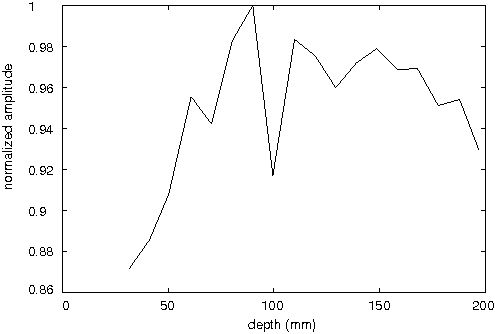
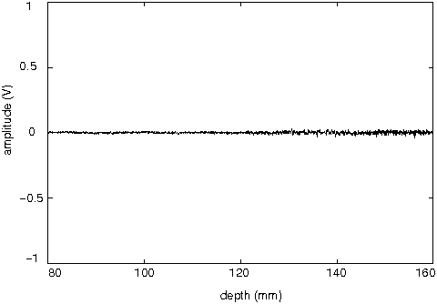
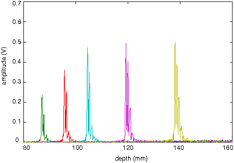

# Device characteristics

## Goal

* 15 frames per second
* 128 gray level
* 64-128 lines
* 60° sector image
* 1 mm resolution
* 3 frequencies:
* * 3.5 MHz \(focal from 50 to 150 mm\)
* * 5 MHz \(focal from 30 to 105 mm\)
* * 7.5 MHz \(focal from 10 et 75 mm\)

## Currently reached

* around 3 frames per second
* 128 gray level
* 64-128 lines
* 60° sector image
* 1 mm radial resolution
* lateral resolution is unknowed yet
* 1 frequency \(3.5 MHz\)

## Characteristics

### Transducer

Following the informations given in [MDL-transducer\_v4](https://github.com/echopen/PRJ-medtec_kit/tree/master/electronic/modules/hardware/MDL-transducer/MDL-transducer_v4) we have:

* Pulse duration at -6 dB: 382 ns \(precision of 0.56 mm\)
* Acoustic pass-band: 2.13 MHz, from 2.21 to 4.33 MHz
* Focal depth: 120 mm
* Excitation: -97 V, 125 ns

### Focal zone

In this section, we present information about the focal zone of the transducer. The focal zone is defined by the amplitude versus depth and the width versus depth. Information about the amplitude can be used to refine amplitude \(_e.g._ gray level\) of the image. Information about width can be used to refined lateral precision when reconstructing image.

To determine the amplitude of the signal along depth \(at the center of the focal zone\) we made images of a plate placed in parallel with the transducer at different depths. The defaut settings have been modified so that amplification is the same all along the sampled depth \(amplification command of 0.4 V during all measurement depth\). Amplification must be chosen so that the TGC won't be saturated during measurements. Results are presented on the following image, apart from measurement errors it looks like a gaussian shape.

## Defaut Settings

Defaut settings are:

* RedPitaya intput range: +/- 20 V \(because TGC output range is +/- 2.5 V\)
* TGC: LO gain mode \(less amplification but too much noise on HI gain mode\)
* TGC amplication command: between 0.3 and 1 V \(so amplification is between 10 and 43.5 dB\)
* Depth of measurement: between 80 and 160 mm
* Number of line: 64
* Angle of the sector: 60°
* Decimation: 8
* Pulser command duration: 125 ns

A sampling rate of 125 Msps would be preferable but depth is a bit short and the transmission of data becomes quite longer \(because there is 8 more times data to send\). Moreover, the data processing in the terminal will be very long.

Even if the TGC output is theoretically in range +/- 2.5 V, generally it is between +/- 1V. For safety we must keep an input range of the RedPitaya within +/- 20 V. This means that instead of having 16384 points of precision, we just have around 800 points of precision.

### Signal

In this section, we present the raw signal and SNR of our device with the default settings.

Here we present some examples of the raw data we obtain with our device with the default settings. First, with a measurement on free space \(no obstacle on the scanned medium\) we can see the default noise of our device:

We can see that we have some noise with our device. The noise is a little bit amplified at the end of measurement when we have maximum amplification \(+ 40 dB\).

We present on the following image some measurement of the echoes from a plate that was put in parallel with the transducer at different depths:

We see that after a depth of 120 mm the amplitude does not increase anymore because the TGC is saturated. We can now determine the envelope of these signals:

We can see that we have a very good SNR \(signal over noise ratio\) defined by:

$SNR=20\log\left\(\dfrac{\max\(signal\)}{\mean\(noise\)}\right\)$.

We don't show it here, but the noise doesn't exceed 0.012 and with have a SNR between 90 and 100 dB.

## Image

In our device the number of lines, the sector angle, the times at which the measure starts and ends and the amplification factor are variable.

With the default settings, we have 1689 points per lines. So an image is composed of 108096 points \(the sector image can be included in a rectangle 91 mm \*160 mm\).

The device is used as an access point and a terminal has to be connected to it. The device sends the RAW data encoded on 16 bits _via_ TCP protocol to the terminal \(so an image has a size of 4.2 Mbits\). The device sends the data line by line \(first 16 bits of the buffer give the number of the line\). The device can send the data to multiple terminals at the same time.

To make an image, the terminal receives data. For each line it determines the envelope of the signal with an Hilbert transform. When all the lines of an image are received and processed, the terminal displays the image on a gray scale as a sector image.

Example of images we obtained with our devices are presented below, a simple plate and a hand:

  

## List of authors

[@GG23800](https://github.com/GG23800)

