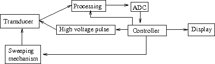
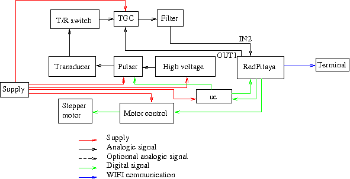

# Hardware documentation

In this section we present a short documentation of our kit. More informations about the hardware can be found in our [website](http://echopen.org/doc-website/CAT-configuration/CFG-aquarium_kit/content.html) or download our [github folder](https://github.com/echopen/PRJ-medtec_kit), aquarium configuration (PRJ-medtec_kit/configuration/CFG-aquarium_kit/readme.md). We show synoptic and block diagrams of the kit and give some informations about daughter boards and modules.

<!--- ### Synoptic diagram

Here is a simple diagram presenting the general functions of the device. The display is made by a terminal such as a smartphone, a tablet or a computer.

 --->

### Block diagram

Here one can find the detailled block diagram of the device to know exactly what is done by the hardware to make acoustic imaging.

The device generates a high voltage pulse to excite the transducer. The rest of the device is protected from the high voltage pulse by a T/R switch. The signal is amplified by a TGC (variable amplification driven by OUT1 of RedPitaya), filtered (pass-band filter) and converted to digital signal (*via* IN2 of RedPitaya). The signal is then sent *via* wifi to a terminal for display. To make a 2D image, the transducer has to make sweep.

Docmentation of the different parts of the device can be found on github:

* RedPitaya: [MDL-redpitaya](https://github.com/echopen/PRJ-medtec_kit/tree/master/electronic/modules/hardware/MDL-redpitaya)
* uc: [MDL-ucontroller_v2](https://github.com/echopen/PRJ-medtec_kit/blob/master/electronic/modules/hardware/MDL-ucontroler/MDL-ucontroler_v2/readme.md)
* Motor control: [MDL-motor_control_v3](https://github.com/echopen/PRJ-medtec_kit/blob/master/electronic/modules/hardware/MDL-motor_control/MDL-motor_control_v3/readme.md)
* Stepper motor: [MDL-motor_v2](https://github.com/echopen/PRJ-medtec_kit/tree/master/electronic/modules/hardware/MDL-motor/MDL-motor_v2)
* High Voltage: [MDL-high_voltage](https://github.com/echopen/PRJ-medtec_kit/blob/master/electronic/modules/hardware/MDL-high_voltage/MDL-high_voltage_v1/readme.md)
* Pulser: [MDL-pulser_v2](https://github.com/echopen/PRJ-medtec_kit/blob/master/electronic/modules/hardware/MDL-pulser/MDL-pulser_v2/readme.md)
* Transducer: [MDL-transducer_v4](https://github.com/echopen/PRJ-medtec_kit/tree/master/electronic/modules/hardware/MDL-transducer/MDL-transducer_v4)
* Supply: [MDL-power_supply_v1](https://github.com/echopen/PRJ-medtec_kit/blob/master/electronic/modules/hardware/MDL-supply/MDL-supply_v1/readme.md)
* T/R switch: [MDL-tr_switch](https://github.com/echopen/PRJ-medtec_kit/blob/master/electronic/modules/hardware/MDL-tr_switch/MDL-tr_switch_v1/readme.md)
* TGC: [MDL-tgc_v1](https://github.com/echopen/PRJ-medtec_kit/blob/master/electronic/modules/hardware/MDL-tgc/MDL-tgc_v1/readme.md)
* Filter: [MDL-filter_v1](https://github.com/echopen/PRJ-medtec_kit/blob/master/electronic/modules/hardware/MDL-filter/MDL-filter_v1/readme.md)
<!---* Envelope detection: [MDL-envelope_detector_v1](https://github.com/echopen/PRJ-medtec_kit/blob/master/electronic/modules/hardware/MDL-envelope_detector/MDL-envelope_detector_v1/readme.md)--->

## Device informations

### Acoustics

We use a commercial transducer from imasonic with a central frequency of 3.27 MHz.l

Excitation:

* time around 140 ns (half the period)
* tension < 150 V.

A transducer must be excited with a negative potential differential, if not the transducer will be depolarized and won't work anymore.

### Mechanic

To make a sector image, a sweeping movement has to be transmitted to the transducer. This is done with a stepper motor. With the stepper driver we can easily change the direction of the steps. When the device is switche on the motor turns and fixes to a mechanical stop (so we now it's position) and then the sweeping movement starts.

### Electronic analogic

Actually we still use two evaluation kits:

* Pulser: MAX4940EVKIT
* TGC: AD8331-EVAL

and three commercial boards:

* Stepper driver: A4988
* Arduino: arduino nano
* Acquisition: RedPitaya

We use an arduino nano because the GPIO of the RedPitaya are too slow to drive the pulser (minimum 500 ns using the C librairy given by RedPitaya), with the arduino (16 MHz clock) the command can be a multiple of 62.5 ns.

The high voltage is obtained by a Cockcroft–Walton multiplier but is not regulated to a given tension.

T/R switch input must been in range +/- 100 V, output is between +/- 2 V.

Pass-band filter is centered around 1.5 MHz but with a very slow slope so it does not impact the signal.

TGC caracteristic:

* Amplification command: between 0 and 1 V
* Amplification on LO gain mode: from -4.5 to +43.5 dB
* Amplification on HI gain mode: from +7.5 to +55.5 dB
* Output: between -2.5 and +2.5 V

### Acquisition

Acquisition is made with a RedPitaya which caracteristics are:

* Sampling rate: 125 or 125/8 Msps
* Precision: 14 bits
* Voltage range: +/- 1 V or +/- 20 V
* Buffer maximum size: 16384 points

Considering that the acoustic waves go back and forth between the transducer and the medium, the depth of measurement is given by d=v*t/2. So a buffer corresponds to a maximum depth of measurement d_m **97 mm** at 125 Msps and **775 mm** at 125/8 Msps. 

The RedPitaya trigger (beggining of measured buffer) can be placed anywhere in a fictitious first buffer (anywhere in the first 16384 points after the trigger event), and the save buffer since RedPitaya trigger is 16384 points long at maximum. This means that the beggining of measurement R0 must be smaller than d_m and end of measurement Rf can be made between R0 and R0 plus d_m:

* at 125 Msps: R0 < 97 mm, R0 < Rf < R0 + 97 mm
* at 125/8 Msps: R0 < 775 mm, R0 < Rf < R0 + 775 mm

### Electronic numeric

The firmware uses three API to simplify comprehension of the final code of the firmware:

* [stepper API](https://github.com/echopen/PRJ-medtec_kit/blob/master/electronic/modules/software/CFG-aquarium_kit/redpitaya/srcbin/stepper.h): this API is used to drive a stepper motor with the RedPitaya when it is plugged to the correct GPIO. With this we can move a stepper in a given direction, with a given angle at a given speed.
* [TCP API](https://github.com/echopen/PRJ-medtec_kit/blob/master/electronic/modules/software/CFG-aquarium_kit/redpitaya/srcbin/TCP_API.h): this API manages the communications using TCP protocol. With this we can simply launch a server and manage connections. Functions are both defined for server or client side.
* [echopen API](https://github.com/echopen/PRJ-medtec_kit/blob/master/electronic/modules/software/CFG-aquarium_kit/redpitaya/srcbin/echopenRP.h): this API uses the RedPitaya librairy and the two previous APIs for making metafuntions of them.

When the program is executed on the RedPitaya, it launches a server, searches the origin of the transducer (put the motor on mechanical stop) and starts scanning the medium: 

* it puts the tranducer at the first line of measurement
* sends a trigger to the arduino to excite the transducer
* waits for the trigger of the arduino to give the 0 mm of measurement
* saves a buffer of the RAW data in a float buffer from R0 to Rf
* converts RAW data into int16_t format
* sends the buffer *via* TCP
* when the buffer is fully sent, it goes to the second line and redoes the process.

A ramp command is sent to the TGC while it acquires data. Both tasks are done at the same time.

Due to TCP protocol, there is no loss of packet. Moreover untill the terminal has not totally received the buffer, the RedPitaya is waiting it insure that data received by the terminal corresponds to the good line. We can observe that when there is no terminal connected to the RedPitaya the scanning of an image is faster than when there is one.

In parallel with the main code, it looks for a connection from a terminal. When a client connects to the device, it sends 6 characters to him that define the image settings: R0, Rf, decimation (sampling rate is 125/decimation), number of lines, angle of the sector and an other variable that is not used here. With R0, Rf and decimation the terminal can determine the number of points per line. With the number of lines and the sector angle it can make the scanconversion.

Multiple connections are supported by the program, so an image can be displayed on several terminals at the same time.

