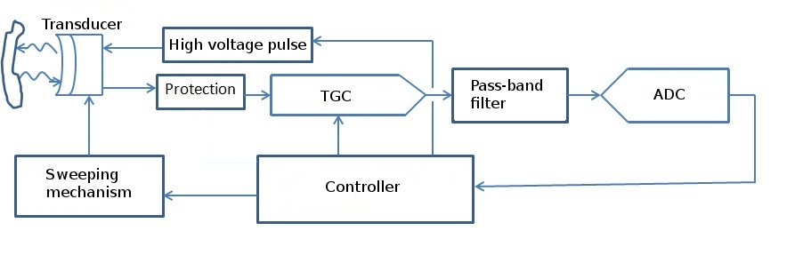
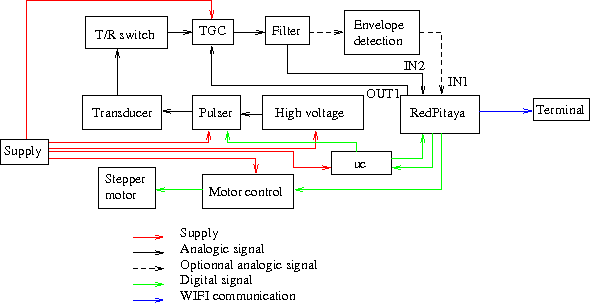

# Hardware documentation

In this section we present a short documentation of our kit. More informations about the hardware can be found in our [website](http://echopen.org/doc-website/CAT-configuration/CFG-sweeping_probe/content.html) or download our [github folder](https://github.com/echopen/PRJ-medtec_kit), aquarium configuration (PRJ-medtec_kit/configuration/CFG-aquarium_kit/readme.md). We show synoptic and block diagrams of the kit and give some informations about daughter boards and modules.

### Synoptic diagram

Here is a simple diagram presenting the general functions of the device.

### Block diagram

Here one can find the detailled block diagram of the device to know exactly what is done by the hardware to make acoustic imaging.

The device generate a high voltage pulse to excite the transducer (*via* or not an impedance matching layer). The rest of the device is protected from the high voltage pulse by a T/R switch. The signal is amplified by a TGC (variable amplification driven by the controller), filtered (pass-band filter) and converted to digital signal. The signal is the send *via* wifi to a terminal for display.

For making a 2D image, the transducer must make a sweeping movement. The transducer is placed on the choosen line by the controller, acquisition is made and send to the terminal, then the transducer is moved to the next line. The lines are angulary equally reparted on the sector of measurement.

## Device informations

### Acoustic

We use a commercial transducer from imasonic with a central frequency of 3.27 MHz. Technical informations about the transducer (temporal and frequential pulse respectively) can be found in the following images

 

Transducer characteristics:

* Pulse duration at -6 dB: 382 ns (precision of 0.56 mm)
* Acoustic pass-band: 2.13 MHz, from 2.21 to 4.33 MHz
* Focal depth: 120 mm
* Excitation time: around half the period = 142 ns
* Excitation voltage: < -150 V

### Electronic (analogic)

Actually we still use two evaluation kits:

* Pulser: MAX4940EVKIT
* TGC: AD8331-EVAL

and three commercial boards:

* Stepper driver: A4988
* Arduino: arduino nano
* Acquisition: RedPitaya

We use an arduino nano because the GPIO of the RedPitaya are two slow to drive the pulser (minimum 500 ns), with the arduino (16 MHz clock) the command can be a multiple of 62.5 ns.

The output of the high voltage circuit is around -97 V.

T/R switch input must been in range +/- 100 V, output is between +/- 2 V.

Pass-band filter is centered around 3.5 MHz.

TGC caracteristic:

* Amplification command: between 0 and 1 V
* Amplification on LO gain mode: from -4.5 to +43.5 dB
* Amplification on HI gain mode: from +7.5 to +55.5 dB
* Output: between -2.5 and +2.5 V

### Mechanic

For making a sector image, we must transmit a sweeping movement to the transducer. This is done with a stepper motor. With the stepper driver we can easily change the direction of the steps. At start the motor turn and fix to a mechanical stop (so we now it's position) and then we make the sweeping movement.

### Acquisition

Acquisition is made with a RedPitaya which caracteristics are:

* Sampling rate: 125 or 125/8 Msps
* Precision: 14 bits
* Voltage range: +/- 1 V or +/- 20 V
* Buffer maximum size: 16384 points

Considering that the acoustic waves makes back and forth between the transducer and the medium, depth of measurement is given by d=v*t/2. So maximum depth at 125 Msps is **97 mm** and at 125/8 Msps it is **775 mm**.

### Working process

The RedPitaya move the transducer to the desired acquisition line. It send a trigger to the arduino wich then send the pulse command to the pulser and a trigger to the RedPitaya at the same time. When receiving the trigger event from the arduino, the RedPitaya wait for a time corresponding to the desired beggining depth of measurement then it start acquisition and at the same time is send the desired amplification command to the TGC until the ending depth of measurement is reached. Then the measured line is send *via* wifi to the terminal using TCP protocol, the data are encoded on int16_t format (signed int coded on 16 bits). When the terminal have received all the data then we restart this working process.

### Settings

Defaut settings are:

* RedPitaya intput range: +/- 20 V (because TGC output range is +/- 2.5 V)
* RedPitaya sampling rate: 125/8 Msps (because depth of measurement is to short at 125 Msps)
* TGC: LO gain mode (less amplification but too much noise on HI gain mode)
* TGC amplication command: between 0.3 and 1 V (so amplification is between 10 and 43.5 dB)
* Depth of measurement: between 80 and 160 mm
* Pulser command duration: 125 ns

A sampling rate of 125 Msps would be preferable but depth is too short and the transmission of data become quite longer (because there is 8 more data to sent).

Even if TGC output is theoretically in range +/- 2.5 V, generally it is between +/- 1V. For safety we must keep an input range of the RedPitaya in +/- 20 V. These means that instead of having 16384 points of precision, we just have around 800 points of precision.

