# Reproducing the device

A [list of supplies by supplier has been prepared](https://github.com/echopen/PRJ-medtec_kit/tree/master/electronic/miscellaneous/general_BOM).

For the BOM, note that the Farnell BOM is only for a laboratory power supply if needed. Moreover, the hackspark BOM is for "basic" fournitures \(for soldering\), and for sockets \(needed for the kit\), therefore it is mainly for showing what can be bought in the closest electronics store.

## PCB soldering guide

For building all the daughter boards we use PCB made by echopen. All components corresponding to each daughter are listed on the BOM \(csv file\) in our [github](https://github.com/echopen/PRJ-medtec_kit/tree/master/electronic/daughter_boards). The IDs of each component are drawned on the PCB, acronyms are:

* R for resistors
* C for capacitors
* D for diodes
* Q for transistors
* P for connectors
* U for integrated circuits

### Resistors

Resistors can be placed on any direction. On a PCB the inscription is as follows:


To know the value of the resistor, refer to the following table.

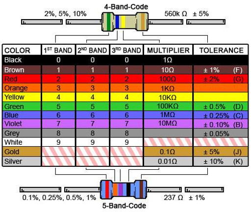

### Capacitors

There are two types of capacitors, polarized one \(electrolitic capacitor for example\) and non-polarized one.

The polarized capacitor must be soldered in the right direction, they are represented by a circle on the PCBs, with half of the circle all painted in white:


The white side of the capacitor corresponds to the lowest potential and must be plugged on the white part of the mark on the PCB.

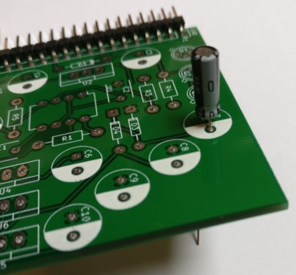

The over capacitors \(ceramic ones, _etc._\) can be place on any direction, they are represented by a single line:

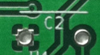

### Diodes

Beware in terms of direction. A line signals the cathode of the diode, which is also marked on the PCB footprint by two lines:


#### LED

LED is the acronym for light-emitting diode  
See scheme below to identify the cathode

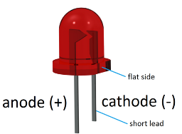

On the PCB, there is an additional line where the cathode must be plugged.

### Transistors

The transistors have three terminals: base, collector, and emitter, they are represented as follows on our PCB:


Match the small strip of the transistors with the one according to the footprint on the PCB.


### Integrated circuits

The dot on the component must be plugged where there is a « line break » \(see below for direction\)

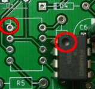

### Voltage regulators

They must be plugged according to the mark on the PCB, _i.e._ the additional rectangle corresponds to the part of the voltage regulator that has sort of a « growth ». On the picture, the voltage regulator is on the correct direction for U4, U5, U6.


### Connectors

#### SMA connectors

The three legs/connectors have to match the three marks on the front side of the PCB, and the two will match the back of it.


The middle pin corresponds to the signal pin and the fourth over to the ground.

### SMT

The Surface Mount Technology components are soldered on the surface of the PCB, we don't need holes to solder them such as THT \(Through Hole Technology\) components. Moreover, these components are generally smaller than the THT ones in order to save space.

To solder the SMT components, one can start by putting a small amount of solder before soldering the component:

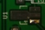

then use a pair of tweezers to ensure the component stays in place during soldering.

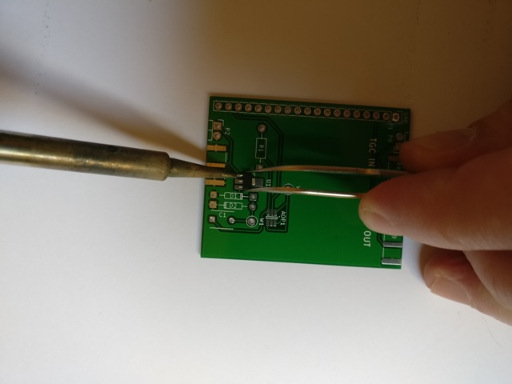

#### IC

To know the direction of the operational amplifier OPA625, search for  
the mark \(line\) to the left of the component:

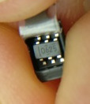

It must match the dot on the PCB:

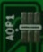

### Desoldering

In case of mistake, use solder wick to remove the solder. Put the wick on the solder, then apply the soldering iron over it \(if your soldering iron have temperature settings, put it on maximum temperature\). Push a bit on the pins to remove the component maintained in place by the remaining solder.

## Motherboard

The motherboard is a matrix board with 19 tracks where we will plug our daughter boards. The signals on each track are given on the following image:


We use a 39 tracks matrix board from RS \(ref: 528-0661\) to make our motherdboard. The original matrix board presents 39 vertical tracks

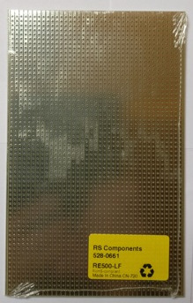

We need 19 tracks, to do this, cut on the track of the middle of the board so that 19 tracks can be preserved on each half of the matrix board, composing the base of the motherboard. One can use a dremel and then smooth the cut.

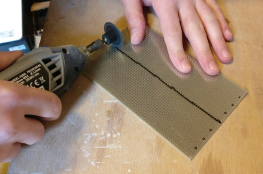


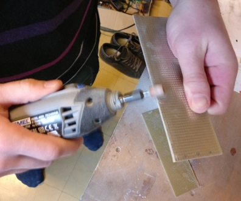

### Sockets

We use 0.1" sockets to connect the daughter boards to the motherboard

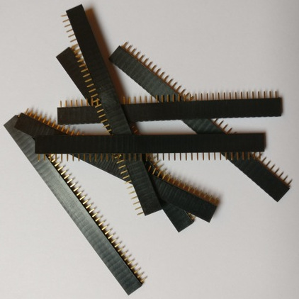

For this, we'll be needing 9 sockets of size 1x19

* first socket on one border \(1\) for power supply
* second socket on \(6\)

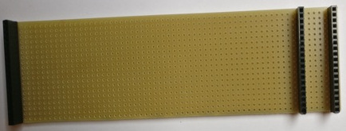

## Power supply

Find all hardware information abous this board in our [github repo](https://github.com/echopen/PRJ-medtec_kit/tree/master/electronic/daughter_boards/DB-supply/DB-supply_v1), and see the [BOM](https://github.com/echopen/PRJ-medtec_kit/blob/master/electronic/daughter_boards/DB-supply/DB-supply_v1/src/DB-supply_v1.csv).

Locations of each component are indicated on the PCB. Follow PCB soldering guide to know how to mount the board.


### Testing the board

The board we've just made is a power-supply board that has several stabilized voltages. It can be tested by powering it properly and checking that output voltages are correct. So as to power it, one will use a lab power supply, offering a good protection against shorts.

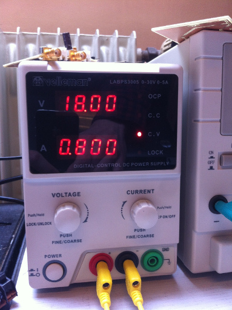

We choose the ideal tension model \(C.V\) with 18V tension output \(which correspond to two 9V batteries that will power the circuit\). The current is limited to 800mA \(this limitation is for the complete prototype, because at start the motor drains high current\).

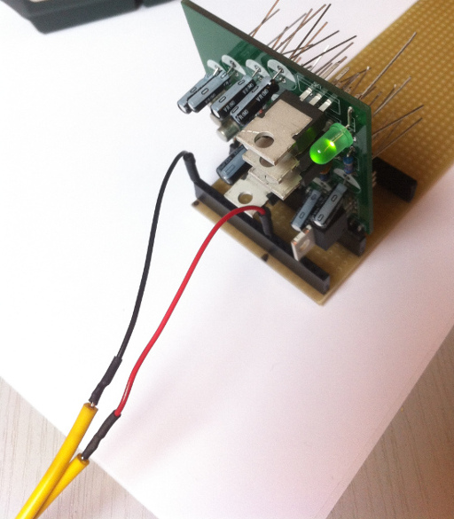

The power supply must be plugged to tracks 1 and 12 \(respectively GND and 18V\). When powering on the supply, the power supply should indicate a current use of 45mA.


We then measure tensions between GND \(track 1\) and tracks 2, 6, 8, 18, 19. To do this, a voltmeter is enough \(or one can use an oscilloscope\). The respective tensions shoudld be 5V, 12V, -12, -5V and 3.3V.

If one of these tensions is missing, one has to check that every component is rightly positioned and that soldering is well done. If there is no negative tension, remove Q2 and Q3 and replace them with new ones.

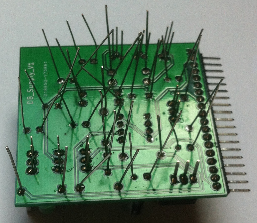

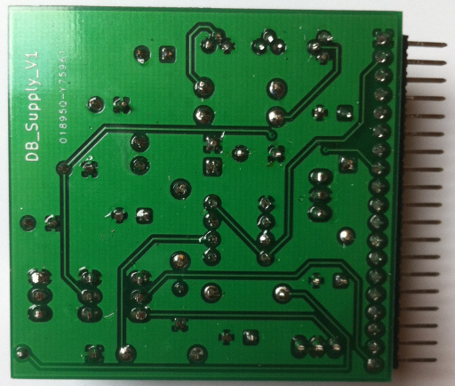

Once the board is validated, one can trim the remaining legs.

## Motor control

Find all hardware informations abous this board in our [github repo](https://github.com/echopen/PRJ-medtec_kit/tree/master/electronic/daughter_boards/DB-motor_control/DB-motor_control_v3), and see the [BOM](https://github.com/echopen/PRJ-medtec_kit/blob/master/electronic/daughter_boards/DB-motor_control/DB-motor_control_v3/src/DB-motor_control_v3.csv).

### Assembly

For the moment, we haven't ordered PCB for that daughter board, one has to do it him/herself with matrix board. Use the second half of the matrix board remaining from cutting the mother board. Soldering instructions and size of the matrix boards are defined on the following figures.

Top view:

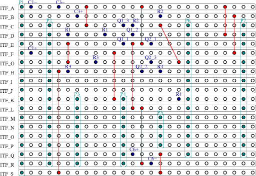

Bottom view:

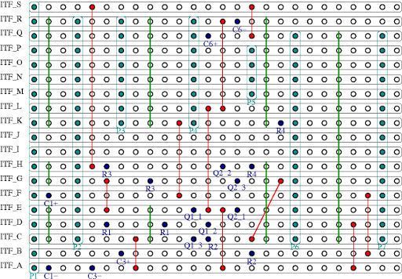

Cuts of tracks that must be done are represented by green lines. Red lines with red dots represent wires that are used to link some tracks, the end of each wire \(plain red dot\) has to be soldered.

Connectors P1 to P7 are represented in light blue and the holes where to solder the different components are represented by hard blue dots.

Note that capacitors C2, C4 and C5 are not put/soldered on this handmade board.

We also have to cut another piece from the matrix board to connect to the RedPitaya as following:

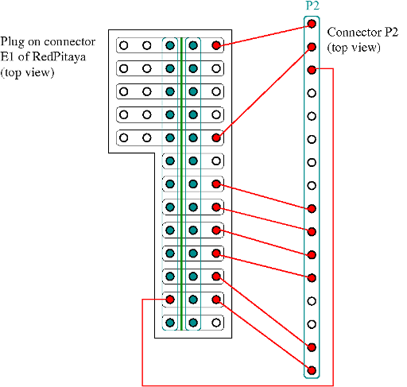

The soldering tracks are on the top of this piece. There are two sockets 1\*13 soldered on it, don't forget to cut the tracks between these two sockets \(cut represented by the green line\).

When you're done, it will look like that:

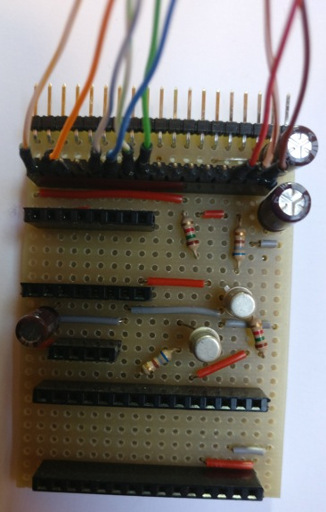

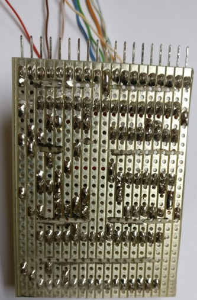

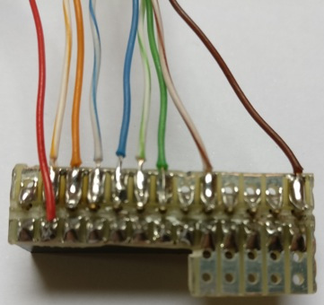

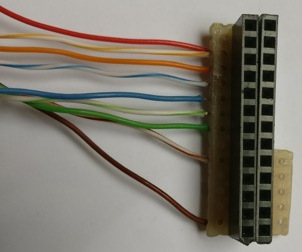

Now all the components \(except stepper motor driver and arduino\) connect the daughter board to the mother to see if there is short circuits \(if there is, current will be at maximum, 800 mA for us, and voltage will be low, not 18 V\).

#### Stepper motor driver

The stepper motor driver is delivered like this:

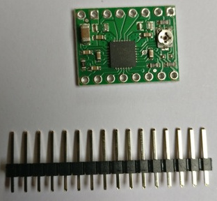

Cut the header in two equal parts and solder them on top of the PCB:

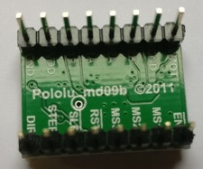

Then plug it on the daughter board:

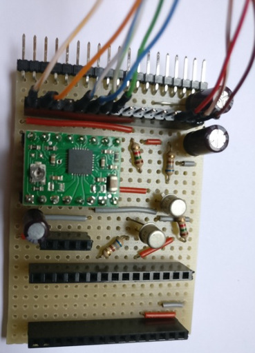

Now we have to set the driver motor stepper by tuning the current in the coil of the stepper at the correct value. Plug two wires on P5 \(the two holes on the top or the two on the bottom\) and plug them to a breadboard. The blue wire of the stepper can be directly linked to P5 and the red wire is linked to P5 _via_ an amperemeter. Turn the screw on A4988 PCB such that the current show on the ampermeter is around 200 mA.

#### Transistor test

**This is an optional step but highly recommanded because the card is hand made and an error can lead to burn some component \(for example the RedPitaya!\).**

First push the code given at the end of the document in an arduino nano and plug it on a breadboard, not on the daughter board for the moment.

Link D4 pin of the arduino to ITF\_D \(on connector P2\) and plug also channel 1 of an oscilloscop to D4. Plug channel 2 of the oscilloscope to ITF\_G on P6 \(on the pictures P2 is connected to a home made connector for the RedPitaya and the wire is plugged on this connector, not on P2\).

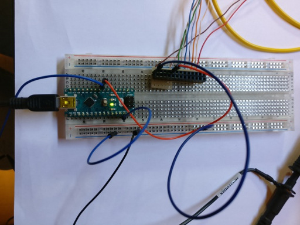

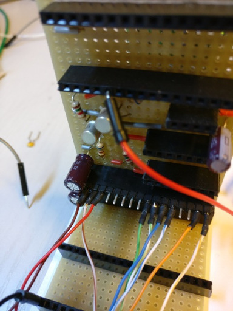

Turn on the supply on the mother board and supply the arduino with a USB cable. One will obtain this on the oscilloscop:

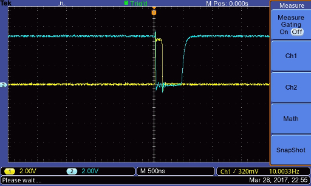

Turn off all the supply. Now plug D4 of the arduino to ITF\_K on P6 and connect also channel 1 of the oscilloscope to it. Connect channel 2 to ITF\_E on P2 \(on the pictures P2 is connected to a home made connector for the RedPitaya and channel 2 is plugged on this connector, not on P2\).

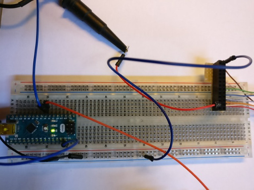

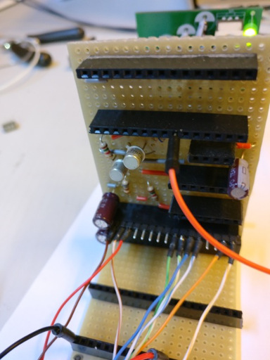

Turn on supply on the motherboard and supply the arduino with a USB cable. One will obtain this on the oscilloscope:

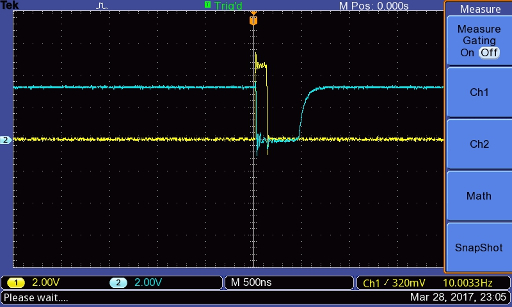

## High voltage

Find all relevant hardware information about this board in our [github repo](https://github.com/echopen/PRJ-medtec_kit/tree/master/electronic/daughter_boards/DB-high_voltage/DB-high_voltage_v1), and see the [BOM](https://github.com/echopen/PRJ-medtec_kit/blob/master/electronic/daughter_boards/DB-high_voltage/DB-high_voltage_v1/src/DB-high_voltage_v1.csv).

#### Finished board

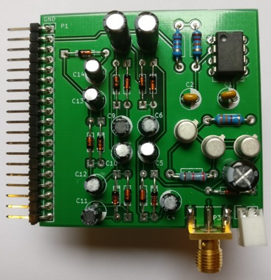

Beware! Check that C14 can stand 100V.

### Tests

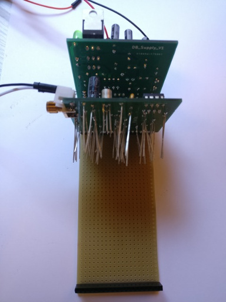

Beware! One has to use a 100V-tolerant oscilloscope, or to use a 10x probe.

Ground is up on connector P2:

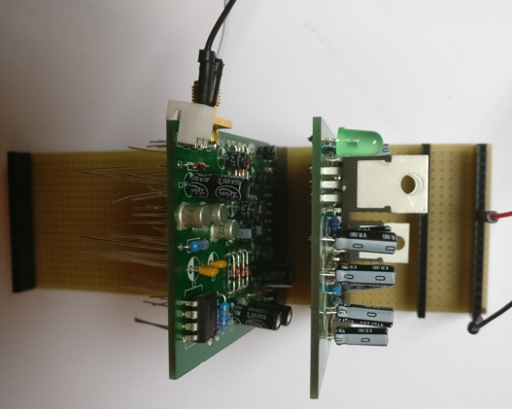

We should get -97 V on the output.

## Pulser

Find all hardware information about this board in our [github repo](https://github.com/echopen/PRJ-medtec_kit/tree/master/electronic/daughter_boards/DB-pulser/DB-pulser_v2), and see the [BOM](https://github.com/echopen/PRJ-medtec_kit/blob/master/electronic/daughter_boards/DB-pulser/DB-pulser_v2/src/DB-pulser_v2.csv).

### Assembly

This daughter uses an external pulser: the _MAX4940 evaluation kit_, that is connected to the daughter via the P3 connector.

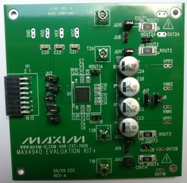

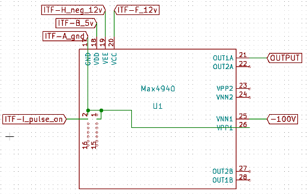

Connect the GND to pins 2 and 3 and VPP1:


Plug components on the pulser daughter board.

Connect the MAX4940 to the daughter board as shown below:

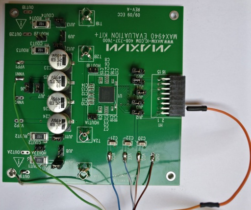

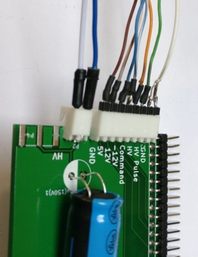

The high voltage is connected as follows: blue wire corresponds to the \(+\), white corresponds to the ground.

### Tests

To test and try the pulser module, connect the output of the board \(P6\) to the oscilloscope.

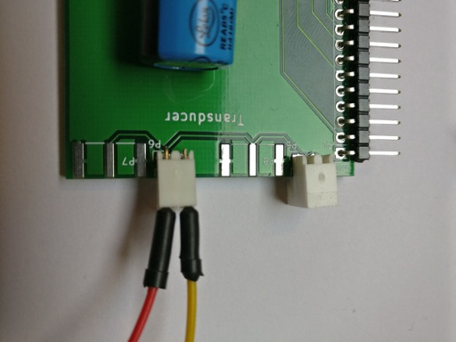

A 5V logic signal of 140ns has to be injected: to do this, we can connect the motor control unit with the testing code to the motherboard.

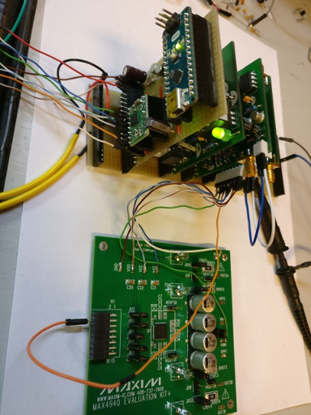

The output signal of the pulser must have the same duration that the logic input, with an amplitude of -97 V.

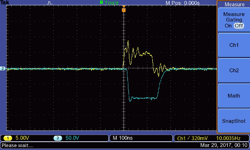

## TGC\_T/R switch board

Find all hardware information about this board in our [github repo](https://github.com/echopen/PRJ-medtec_kit/tree/master/electronic/daughter_boards/DB-tr_switch_tgc/DB-tr_switch_tgc_v1), and see the [BOM](https://github.com/echopen/PRJ-medtec_kit/blob/master/electronic/daughter_boards/DB-tr_switch_tgc/DB-tr_switch_tgc_v1/src/DB-tr_switch_tgc_v1.csv).

### Tests T/R switch

* Solder all components on the PCB
* Do not connect the AD8331 evaluation kit to this PCB for the moment
* Connect all daughter boards to the motherboard
* Connect the pulser SMA output to the input SMA of the T/R switch with a SMA male/SMA male wire
* Connect track 9 of the motherboard to the oscilloscope input 1
* Connect test point W1 of the T/R switch to input 2 

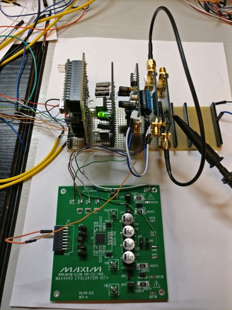

Here's what you should obtain on the oscilloscope

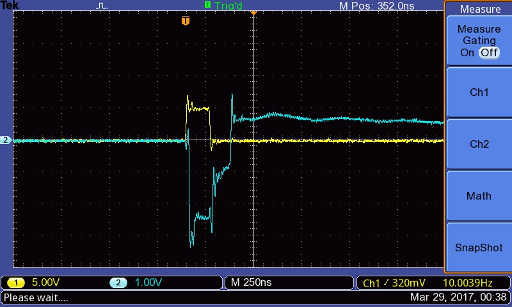

pulser command is on Channel 1 \(yellow\) and the T/R switch output \(W1 test point\) is on Channel 2 \(blue\).

#### Possible problem with the T/R switch

Sometimes, the T/R switch \(MD0100\) may burn. If this happens, the output will look something like that:

put the good figure

To check the diagnosis, connect the oscilloscope to the output of the pulser, if the T/R switch has burned the pulse will be -20V instead of -100V:

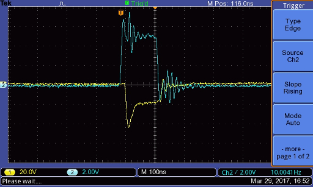

#### First echoes

With these daughter boards, we are now able to see echoes from a transducer, one can put it in a mug for example. Connect the transducer on the second SMA output and send repeated pulses on it, connect channel 1 of an oscilloscope on connector P4 or P7 of DB\_pulser and channel 2 on test point W1. Settings of the oscilloscope must be something like 10 microseconds per division and 50 or 100 mV per division. Now move the transducer until you see echoes on the oscilloscope:

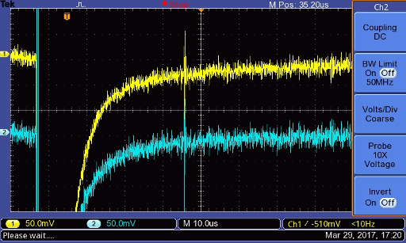

The amplitude of the echo must be exactly the same on channel 1 and channel 2.

### Connecting the TGC

Solder two wires, one on +5V and the other on a GND test points \(for the power supply\)

Solder two header pins on GAIN and another GND test point so that wires can be connected - or, if you prefer, solder wires directly. They will be connected straight on the RedPitaya for gain control.

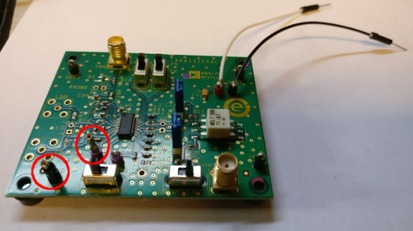

The two header pins are circled in red.

Now, use two sma wires to connect TGC IN of DB\_trs\_tgc on TGC INH and TGC OUT of DB\_trs\_tgc on TGC VOUT. Connect 5V and GND of the TGC on the tracks 2 and 1 of the motherboard respectively.

#### Settings

Note, switch positions of the TGC:

* switch LNA EN on EN
* switch VGA EN on EN
* switch GN SLOPE on UP
* switch GN HI LO on LO

### Tests

For the first test, do not connect a wire to the gain of the TGC \(pin the header circle in red in last figure\). Connect channel 1 of an oscilloscope to test point W1 and channel 2 to track 3 of the mother board. Such as for the T/R switch, move the transducer until you see echoes, on channel 2 you will see amplified echoes.

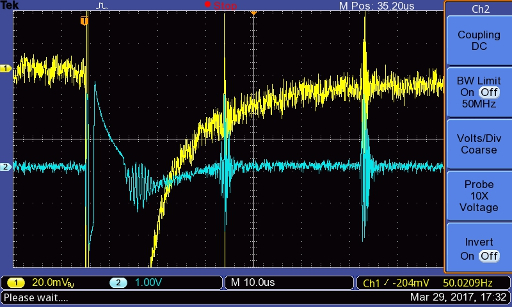

## RedPitaya

Find all hardware information about this board in our [github repo](https://github.com/echopen/PRJ-medtec_kit/tree/master/electronic/modules/hardware/MDL-redpitaya).

### Connectors \(to do three times\)

* Cut a male-male SMA cable in half
* Remove the end of the cable 


* With a flat screwdriver, disassemble the braided shield \(composed of multiple wires braided togever\)
* Roll them together.


* Remove the protection from the center conductor


* Connect the braided shield to a wire \(that'll be the ground, black on the following figure\)
* Connect the center conductor to another wire \(that'll be the signal, white on the following figure\), put a heat-shrink sleeve around the solder to protect from short-circuits with ground. 


* Connect RedPitaya In1 to the tracks 3 and GND of the motherboard 
* Connect RedPitaya In2 to the tracks 4 and GND of the motherboard 
* Connect RedPitaya OUT1 to the header wire GAIN and GND of AD8331 evalutation kit

## Overall configuration including all modules


## RedPitaya and Arduino codes installation

### Arduino

Push [this program](https://github.com/echopen/PRJ-medtec_kit/blob/master/electronic/modules/software/CFG-aquarium_kit/arduino/MDL-pulser_v2/MDL-pulser_v2.ino) in your arduino nano.

### RedPitaya

* Format the RedPitaya SD card in FAT-32
* Refer to [these instructions](https://github.com/echopen/PRJ-medtec_kit/tree/master/installation/linux_user) section **prepare the RedPitaya** to install the OS.
* Download [this folder](https://github.com/echopen/PRJ-medtec_kit/tree/master/electronic/modules/software/CFG-aquarium_kit/redpitaya). Launch a terminal and go to this repo on your computer \(with a Linux OS\) then copy the executable on the RedPitaya and run it. You must first connect to RedPitaya wifi network, pass redpitaya.

## Mechanics

### Setup

To complete the kit, one has to 3D-print some pieces located in PRJ-medtec\_kit/mecanic/modules. At least we need MDL-motor\_support, MDL-rod\_fixation and MDL-transducer\_support, with these modules we have the strictly minimal device to make a measurement in an aquarium. Use the .stl files present in the different folders for 3d-printing them. Note that for the moment, MDL-transducer\_support will have to be adapted for your own transducer because we have no « serial » transducers to ship with our kit yet. One can do that by using freecad \(open the .igs file\) modify and then export in .stl file \(mesh formats files\).

First print MDL-motor\_support, at the end it will look something like that:


Take off the plastic support, there is still plastic in the hole where we will put the motor :


Take it off too with pliers for example, and it’s finished:


Now fix the motor to this support with 2 or 4 screw 3 mm diameter, 6mm long.

Now print MDL-rod-fixation, the two holes on each side of this part of the cylinder. The bigger one is for the motor axe. Fix this axis with a 3mm diameter 10 mm long screw. This screw must be 10 mm minimum because it must stick out so it will hit the motor\_support when initialising \(searching it's 0\). The second one is used to fix the rod, prefer using a wood screw, 3 mm diameter.


The rod is a metal rod 4 mm diameter, prefer stainless steel, because it will be immersed in water, We use 100 mm long rod, but the only limitation on the length is that the transducer must be immersed and the electrical connection of the transducer must not.

Then print the tranducer support and fix it to the rod.


### Arduino code for test

Arduino test code for assembly:

Remarks:

* If the duration of the pulse is too long \(&gt;125 ns\) delete line 6 \(NOP;\), this can happened with "bad" arduino copy.

```
#define NOP asm volatile ("nop\n\t");

void pulse()
{
PORTD=B01010000;
NOP;
PORTD=B00000000;
}

void setup() {
// put your setup code here, to run once:
DDRD = B01010000;
}

void loop() {
// put your main code here, to run repeatedly:
pulse();
delayMicroseconds(500);
}
```

## List of authors

[Alister Trabattoni](https://github.com/halipster)

[Aurélie](https://www.gitbook.com/book/echopen/echopen_prototyping/edit#)

[@GG23800](https://github.com/GG23800)

[K. Ghosh](https://www.gitbook.com/book/echopen/echopen_prototyping/edit#)

